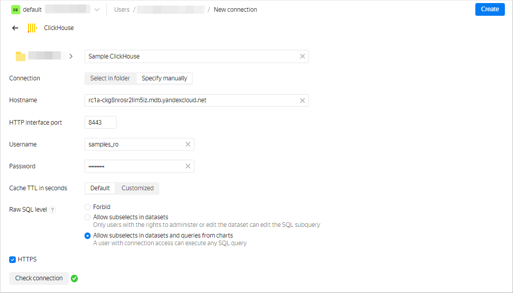



1. Go to the [connections page]({{ link-datalens-main }}/connections).
1. Click **Create connection**.

1. Select the **ClickHouse** connection.

   
   1. In the window that opens, specify the connection parameters:

      * Connection type: **Specify manually**.
      * Host name: `rc1a-ckg8nrosr2lim5iz.{{ dns-zone }}`.
      * HTTP interface port: `8443` (default).
      * Username: `samples_ro`.
      * Password: `MsgfcjEhJk`.

    1. Enable **Allow subqueries in datasets and queries from charts**.
    1. Check the connection and click **Create connection**.
    1. Enter the connection name: `Sample ClickHouse`.
    1. Click **Create**.

      
      

Wait for the connection to be saved.
