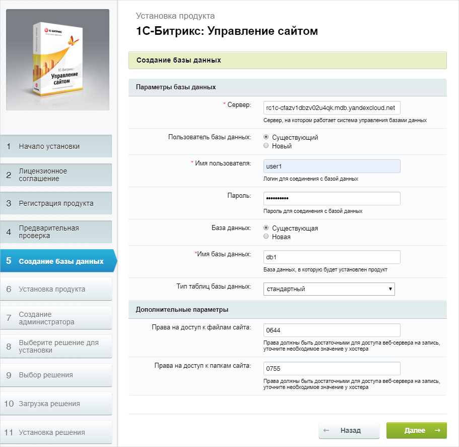
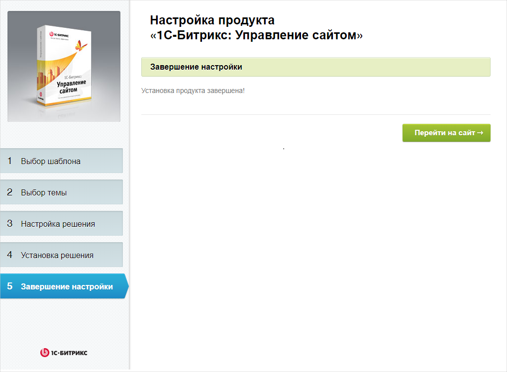

Install and configure 1C-Bitrix:
1. Open the 1C-Bitrix: Site Management web interface. To do so, in your browser, go to `http://<VM_public_IP_address>/`. This should open a page prompting you to install 1C-Bitrix.
1. Click **Next**.

   

1. Read the license agreement and select **I accept the license agreement**. Then click **Next**.

   

1. Registration is optional, so you can uncheck the corresponding checkbox, but leave **Install in UTF-8 encoding** and click **Next**.

   

1. 1C-Bitrix will check if the server is configured correctly. View the parameters on this page and click **Next**.

   

1. Configure the database:
   1. In the **Server** field, enter the fully qualified domain name (FQDN) of the DB you created. To find out this name:
      1. In the [management console]({{ link-console-main }}), open the folder page in a new browser tab.
      1. In the list of services, select **{{ ui-key.yacloud.iam.folder.dashboard.label_managed-mysql }}**.
      1. In the window that opens, select the `BitrixMySQL` cluster you created earlier.
      1. Select the **{{ ui-key.yacloud.mysql.cluster.switch_hosts }}** tab in the left-hand menu.
      1. In the **{{ ui-key.yacloud.mdb.cluster.hosts.host_column_name }}** field, hover over the host name (format: `rc1c-cfazv1db********`) and copy the database FQDN by clicking . The FQDN will be added to the host name, so the **Server** field should contain a name in `rc1c-cfazv1db********.{{ dns-zone }}` format.
   1. In the **Username** and **Password** fields, enter the data that you specified when creating the DB in [Create a {{ MY }} DB cluster](#create-mysql).
   1. In the **Database name** field, specify the name of the new database (`db1`).
   1. Click **Next**.

   

1. Wait for the {{ MY }} DB to initialize.

   

1. Create an administrator account authorized to make changes to your system. Fill in all the fields and click **Next**.

   

1. Select the **Information portal** template and click **Next**.

   

1. Confirm the selection of the only layout template available and click **Next**.

   

1. Select a color and click **Next**.

   

1. Fill in all the fields according to your website requirements and click **Install** to start the installation and configuration of all the system components. Wait for its completion.

   

1. After a while, a notification page will open to inform you that the system is installed and configured. To start using the website, click **Go to website**.

   

1. You can now start working with the ready-to-use web interface in content editing mode.

   

1. To view the website home page as a user, exit your website administration mode. To do this, click **Exit** in the top-right corner of the page and go to `http://<VM_public_IP_address>/`.
   To return to edit mode, log in to the website using the administrator credentials you provided when configuring 1C-Bitrix.

   