# Simple dashboard from a CSV file



This guide demonstrates how to use {{ datalens-short-name }} to analyze dependencies, for example:

* Superhero’s eye and hair color on their gender.
* Superhero’s eye and hair color on their good or evil alignment.

For source data, we are going to use the `SuperHeroes.csv` file with data about the superheroes: name, gender, race, comics publisher, etc. [Download](https://storage.yandexcloud.net/datalens/SuperHeroes.csv) it before going through the guide.

To visualize and explore data, [set up {{ datalens-short-name }}](#before-you-begin) and follow the steps below:

1. [Create a workbook](#create-workbook).
1. [Create a connection](#create-connection).
1. [Create a dataset](#create-dataset).
1. [Create a bar chart](#create-column-chart).
1. [Create a donut chart](#create-ring-chart).
1. [Create a dashboard and add charts to it](#create-dashboard).
1. [Add selectors to the dashboard](#add-selectors).
1. [Start analyzing superhero dependencies and data](#search-on-dashboard).

## Getting started {#before-you-begin}



## Create a workbook {#create-workbook}

1. Go to the {{ datalens-short-name }} [home page]({{ link-datalens-main }}).
1. In the left-hand panel, select  **Collections and workbooks**.
1. In the top-right corner, click **Create** → **Create workbook**.
1. Enter a name for the [workbook](../../datalens/workbooks-collections/index.md): `Tutorials`.
1. Click **Create**.

## Create a connection {#create-connection}

Create a [connection](../../datalens/concepts/connection.md) to the source data file.

1. In the top-right corner of the workbook, click **Create** →  **Connection**.

1. Under **Files and services**, select the **Files** connection.
1. Click  **Upload files**.
1. Select the **SuperHeroes.csv** file. Wait until the table content appears on the screen.
1. Click **Create connection**.

   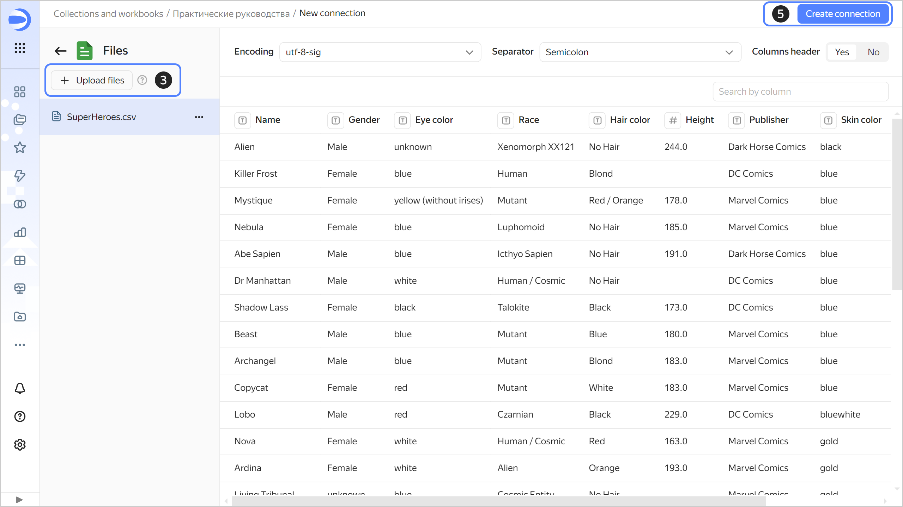

1. Enter `SuperHeroes` for connection name and click **Create**.

## Create a dataset {#create-dataset}

Create a [dataset](../../datalens/dataset/index.md) based on the `SuperHeroes` connection:

1. In the top-right corner of the connection page, click **Create dataset**.
1. Go to the **Fields** tab.
1. Create a measure field with the number of superheroes:

   1. Duplicate the `Name` field: on the right side of the row with the field, click  and select **Duplicate**.
   1. Rename the `Name (1)` duplicate field as `Heroes count`: click the field name, delete the current name, and enter the new one.
   1. In the **Aggregation** column, select **Number of unique**. The aggregation field will change its color to blue: it is now a measure.

      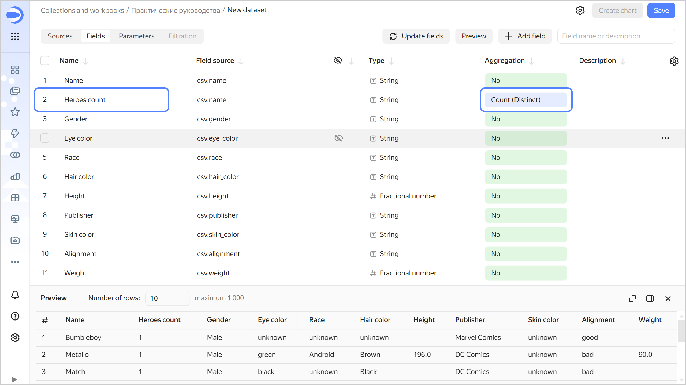
   
1. Save the dataset:

   1. In the top-right corner, click **Save**.
   1. Enter `SuperHeroes dataset` for the dataset name and click **Create**.

## Create a column chart {#create-column-chart}

To visualize superheroes split into good and evil, create a [chart](../../datalens/concepts/chart/index.md), e.g., a [column chart](../../datalens/visualization-ref/column-chart.md):

1. Click **Create chart** in the top-right corner of the dataset page.
1. Add the good or evil property to your chart. To do this, drag the `Alignment` field from **Dimensions** to the **X** section.
1. Add the number of superheroes to your chart. To do this, drag the `Heroes count` field from **Measures** to the **Y** section.
1. Sort the columns by number of superheroes. To do this, drag the `Heroes count` field from **Measures** to the **Sorting** section.

   

1. Color code superheroes in the chart based on whether they are good or evil. To do this, drag the `Alignment` field from **Dimensions** to the **Colors** section.
1. Redefine the colors for the `Alignment` dimension:

   1. Click  in the **Colors** section (the icon is displayed when you hover over the section).
   1. Select the colors: green for **good**; blue for **neutral**; red for **evil**; orange for **unknown**.
   1. Click **Apply**.

      

1. Add labels to your chart with the number of superheroes. To do this, drag the `Heroes count` field from **Measures** to **Labels**.

   

1. Save the chart:

   1. In the top-right corner, click **Save**.
   1. In the window that opens, enter a name for the chart: `SuperHeroes: Alignment`, then click **Save**.

   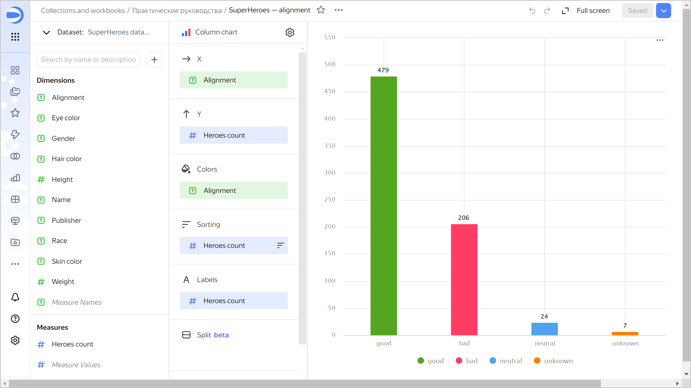

## Create a donut chart {#create-ring-chart}

To display the number of heroes of each gender, create a [donut chart](../../datalens/visualization-ref/ring-chart.md).

1. Copy the chart you created in the previous step:

   1. In the top-right corner, click  → **Save as copy**.

      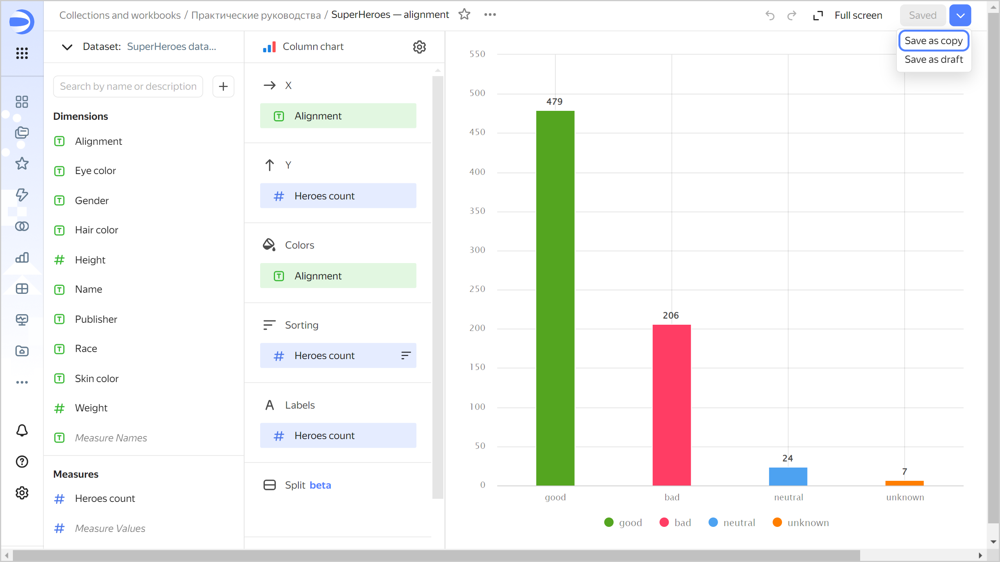

   1. In the window that opens, enter a name for the new chart: `SuperHeroes: Gender`, then click **Save**.

1. Select the **Donut chart** visualization type.

   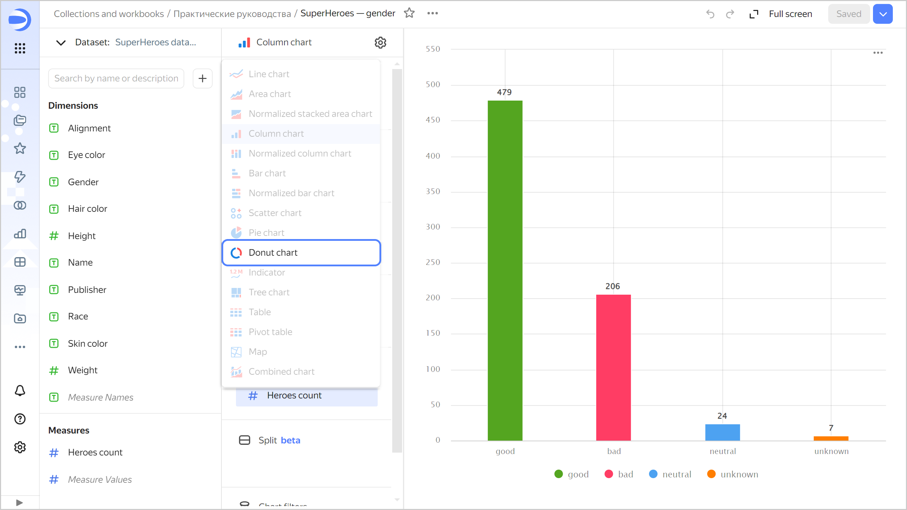

1. Replace the good-evil color code with the gender color code. To do this, drag the `Gender` field from **Dimensions** to **Color** and hold it over the `Alignment` field until the latter turns red.
1. Redefine the colors for the `Gender` dimension:

   1. Click  in the **Colors** section (the icon is displayed when you hover over the section).
   1. Select colors: Pink for **Female**; blue for **Male**; orange for **unknown**.
   1. Click **Apply**.

1. Set the chart to display the number of superheroes by gender as a percentage:

   1. Click the icon before the field name in the **Labels** section.
   1. In the **Label value** field, select `Percentage`, then click **Apply**.

   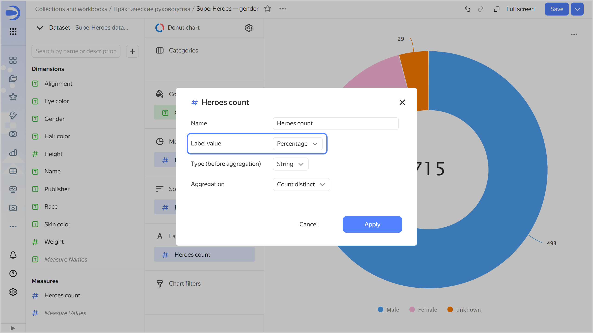

1. Save your chart: click **Save** in the top-right corner.

   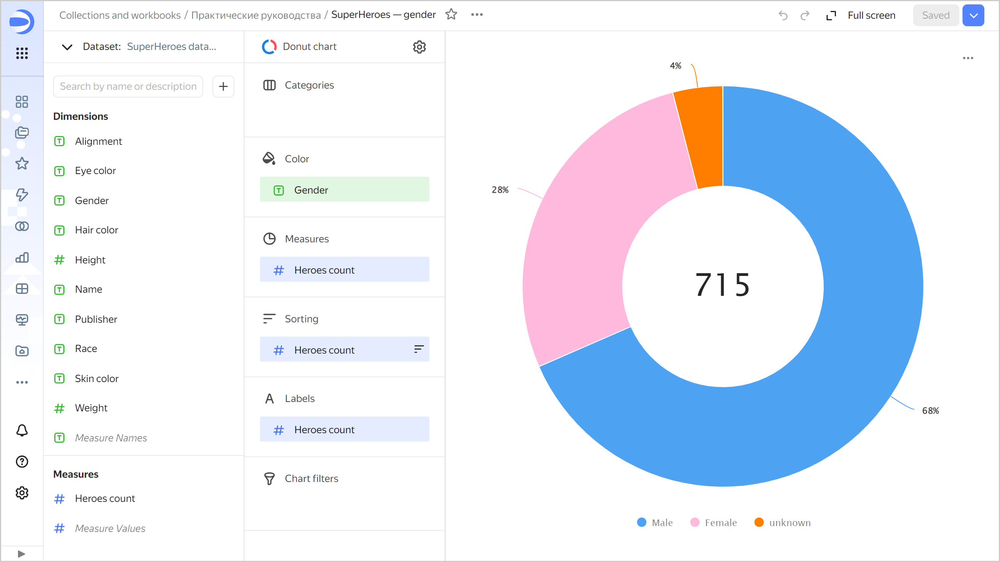

## Create a dashboard and add charts to it {#create-dashboard}

Create a [dashboard](../../datalens/concepts/dashboard.md) to add charts and other widgets to:

1. In the left-hand panel, select  **Collections and workbooks** and go to the `Tutorials` workbook.
1. In the top-right corner, click **Create** →  **Dashboard**.

1. In the panel at the bottom of the page, select **Chart**.

   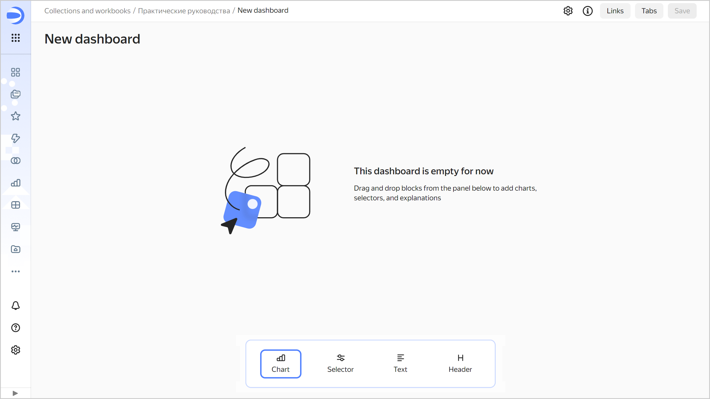

1. In the window that opens, click **Select**.
1. Select the `SuperHeroes: Gender` chart.
1. Click **Add**.

   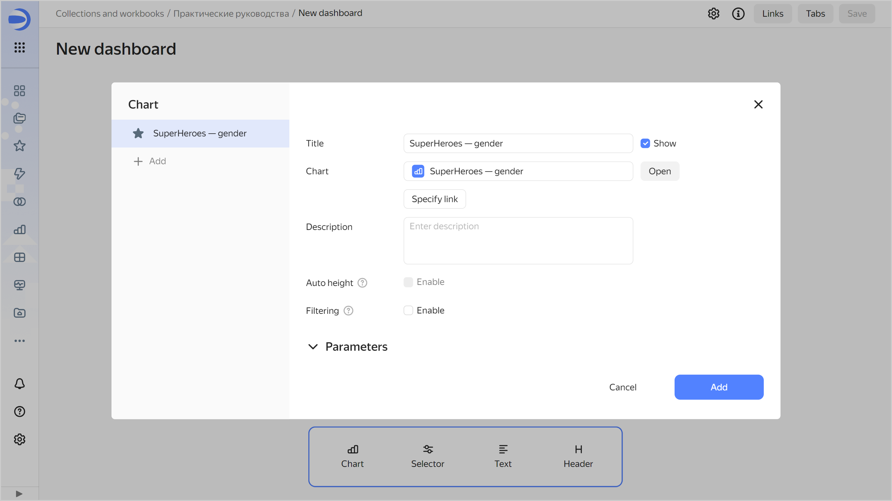

1. Repeat steps 3-6 to add the `SuperHeroes: Alignment` chart.
1. Adjust the size of the charts with your mouse and place them on the dashboard as you prefer.

   

## Add selectors to the dashboard {#add-selectors}

Add [selectors](../../datalens/dashboard/selector.md) to filter superheroes by `Eye color` and `Hair color`:

1. In the panel at the bottom of the page, choose **Selector**.

   

1. Add a selector for eye color:

   1. Select `SuperHeroes dataset`.
   1. Select the `Eye color` field.
   1. Enable **Multiple choice**.
   1. Click **Save**.

   

1. Add a selector for hair color:

   1. Make sure you selected the `SuperHeroes dataset` dataset.
   1. Select the `Hair color` field.
   1. Enable **Multiple choice**.
   1. Click **Save**.

1. Position the selectors on the dashboard however you like.
1. Save the dashboard:

   1. In the top-right corner of the dashboard, click **Save**.
   1. Enter `SuperHeroes dashboard` for the dashboard name and click **Create**.

1. Your dashboard is ready.

   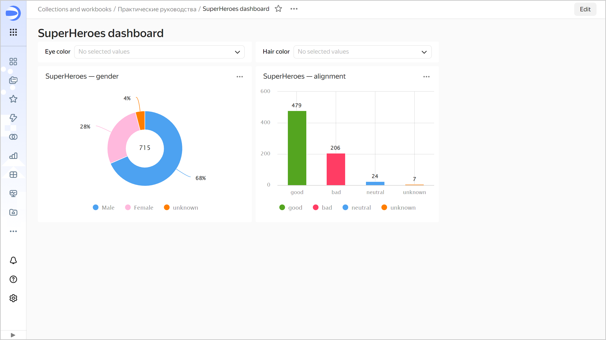

## Analyze data about superheroes {#search-on-dashboard}

1. Apply various filters and analyze the eye and hair color dependencies on a superhero's gender and good or bad alignment.

   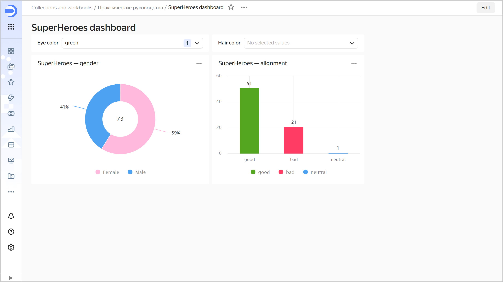

   The dataset analyzed shows the following dependencies:

   * There are more men with black eyes and more women with green eyes.
   * There are more good ones with blue eyes and evil ones with red eyes.
   * There are more women with red hair and more men with black hair.
   * There are more evil ones with gray hair and more good ones with brown hair.

1. Next, you can:

   * Create new measures in the dataset, e.g., average height (`Height` field average) and average weight (`Weight` field average) of superheroes.
   * Add new charts to the dashboard, e.g., an indicator with the number of superheroes or a bar chart with the number of superheroes by publisher.
   * Add new selectors to the dashboard, e.g., to select a publisher or superhero race.
   * Explore more patterns.