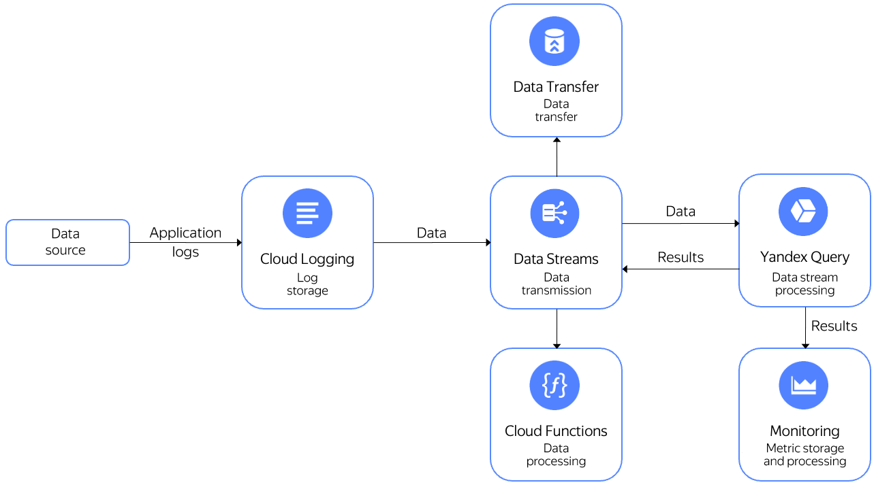

# Processing {{ cloud-logging-full-name }} logs

[{{ cloud-logging-full-name }}](../../logging/index.yaml) is a service for reading and writing logs of {{ yandex-cloud }} services and user applications.

Logs can be sent to a [stream](../../data-streams/concepts/glossary.md#stream-concepts) in {{ yds-full-name }} and then processed in real time using {{ yq-full-name }}. You can do the following with processed data:

* Send it to {{ monitoring-full-name }} to make charts and use it in alerting.
* Write it to a stream in {{ yds-short-name }} and then send it to {{ sf-full-name }} for processing.
* Write it to a stream in {{ yds-short-name }} and then transfer it to {{ data-transfer-full-name }} to be [sent to various storage systems](../../data-streams/tutorials/data-ingestion.md).



In this use case, you will send {{ cloud-logging-short-name }} logs to a stream in {{ yds-short-name }} and then run a query to them using {{ yq-name }}. The query will return the number of messages per host grouped by 10s interval.

To implement this use case:

1. [Create a data stream in {{ yds-name }}](#create-yds-stream).
1. [Create a {{ cloud-logging-name }} log group](#create-log-group).
1. [Start sending data to the log group](#send-to-loggroup).
1. [Connect {{ yq-name }} to your data stream](#connect-query).
1. [Query the data](#query).

## Getting started {#before-you-begin}



Install the {{ yandex-cloud }} [command line interface](../../cli/quickstart.md#install).

## Create a stream in {{ yds-name }} {#create-yds-stream}

[Create a data stream](../../data-streams/operations/manage-streams.md#create-data-stream) named `cloud-logging-stream`.

## Create a log group named {{ cloud-logging-name }} {#create-log-group}

[Create a log group](../../logging/operations/create-group.md) named `cloud-logging-group`. When setting the log group parameters, specify `cloud-logging-stream` created in the previous step.

## Start sending data to the log group {#send-to-loggroup}

To start sending data to the log group, run this command:

```bash
while true; do yc logging write \
  --group-name=cloud-logging-group \
  --message="test_message" \
  --timestamp="1s ago" \
  --level=INFO \
  --json-payload='{"request_id": "1234", "host":"test_host"}' \
  --folder-id b1kmrhakmf8a********; \
  sleep 1; \
done
```

* `--group-name`: Name of the log group to send messages to.
* `--message`: Message text.
* `--json_payload`: Additional message data in JSON format.
* `--folder-id`: ID of the folder the log group is created in.

   

   You can leave out the `--group-name`, `--message`, and `--json-payload` flags and specify only the parameter values, e.g., `cloud-logging-group "test_message" '{"request_id": "1234", "host":"test_host"}'`.

   

## Connect {{ yq-name }} to your data stream {#connect-query}

1. [Create a connection](../../query/operations/connection.md#create) named `cloud-logging-connection` of the `{{ ui-key.yql.yq-connection.action_datastreams }}` type.
1. On the binding creation page:
    * Select **{{ ui-key.yql.yq-binding-form.binding-fields-templates.button.label }} {{ cloud-logging-short-name }}**.
    * Enter a name for the binding: `cloud-logging-binding`.
    * Specify the data stream: `cloud-logging-stream`.
    * Set the `json-list` format.
1. Click **{{ ui-key.yql.yq-binding-form.binding-create.button-text }}**.

## Query the data {#query}

Open the query editor in the {{ yq-name }} interface and run the query:

```sql
$cloud_logging_data = 
SELECT 
    CAST(JSON_VALUE(data, "$.timestamp") AS Timestamp) AS `timestamp`,
    JSON_VALUE(data, "$.jsonPayload.host") AS host
FROM bindings.`cloud-logging-binding`;

SELECT 
    host, 
    COUNT(*) AS message_count, 
    HOP_END() AS `timestamp`
FROM $cloud_logging_data
GROUP BY 
    HOP(`timestamp`, "PT10S", "PT10S", "PT10S"), 
    host
LIMIT 2;
```

Result:

| # | host | message_count | timestamp |
| :--- | :--- | ---: | :--- |
| 1 | "test_host" | 3 | 2023-05-09T10:34:00.000000Z |
| 2 | "test_host" | 4 | 2023-05-09T10:34:10.000000Z |



## See also {#see-also}

* [{#T}](../../query/sources-and-sinks/data-streams.md)
