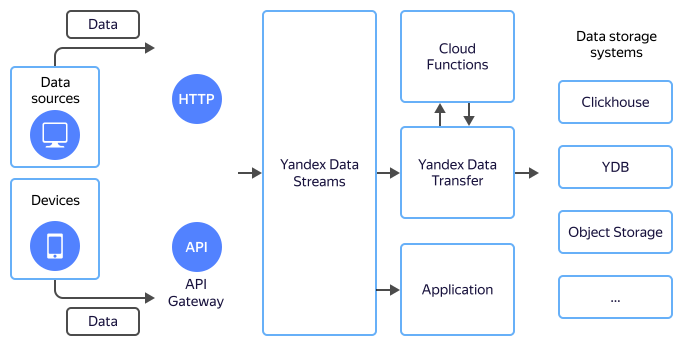

# Entering data into storage systems

Mobile phones, various smart devices, and external services are increasingly replacing application components as data sources.

Such sources supply data in massive numbers of small batches. The communication channels used for transmission are often slow, and the communication time limited. Under such conditions, you want to quickly save the data you receive. Its processing can wait till later. This is why the data first goes to data streaming buses to be collected for processing from there.

As a data streaming bus, {{ yds-full-name }} provides optimal operation modes for sources and targets:

* Accepts incoming data with high frequency and speed without blocking the sources.
* Saves the received data in its own storage.
* Generates data batches and sends them to target systems reducing the load on them.

## Benefits {#advantages}

When working with external devices or services, you want to quickly save the data you receive. You can fetch the saved data from {{ yds-short-name }} through direct reads or by setting up data delivery to {{ yandex-cloud }} storage systems using {{ data-transfer-full-name }}.

### Receiving data {#receiving}

Data is transmitted to {{ yds-short-name }} over [HTTP](../../data-streams/kinesisapi/api-ref.md). Using [{{ api-gw-full-name }}](/services/api-gateway), you can implement any protocol for incoming data. Data received in {{ api-gw-name }} can be forwarded to {{ yds-short-name }} as well.

{{ yds-short-name }} is highly scalable and can accept data from thousands of data sources at the same time.

### Reliability {#reliability}

A data streaming bus is an important infrastructure component. It is tolerant to any type of {{ yandex-cloud }} failures. Data input in {{ yds-short-name }} is saved to at least three {{ yandex-cloud }} availability zones.

### Batching {#batching}

Data storage and processing systems perform at their best if data is written to them in batches. The most effective place for batch generation is the single entry point you channel all your data to. Its role is normally performed by data buses.

### Rewinding data {#rewind}

Unlike message queues, data buses store data until the retention period expires without deleting the data after it is read. This allows you to move across the stored data in any direction: from the oldest to the most recent. For example, if a new data format appears and gets incorrectly written to the target system, you can rewind the data stored in a bus to the beginning and then reread and rewrite it to the target system correctly.

### Multiple storage systems {#multiple}

The same data is often stored in multiple storage systems at once: in {{ CH }} for fast analysis and in {{ objstorage-name }} for long-term storage. With data buses, you can easily handle this: as different apps can read data concurrently, you can set up sending the same data to both storage systems: {{ CH }} and {{ objstorage-name }}. This solution will also let you add a third storage system, such as {{ GP }} or {{ ES }}, at any time.

The multiple storage system approach is very convenient for ensuring compliance with FZ-152, PCI DSS, and other standards requiring that data be stored for at least one year. In which case the last month's data can go to one storage system for quick access, and the rest of the data to a cold storage in {{ objstorage-name }} for long time storage.

### Masking data and processing logs {#mask}

Some data is not accessible to all employees. For example, data with users' personal data access to which must be limited.

Transmitted data can be sent for processing to {{ sf-name }} where it can be masked or handled in any other way.

Once processed, the data can be sent to multiple target systems at once: access to the data containing masked personal data can be granted to all employees while access to the full data to administrators only.

### Reading data {#read}

You can process the data saved in {{ yds-short-name }} programmatically. {{ yds-short-name }} is compatible with the Amazon Kinesis Data Streams API, allowing you to use SDKs for different programming languages: C++, Java, Go, Python, etc.

## Setup {#setup}

To set up data input to storage systems:

1. [Create a data stream](../../data-streams/quickstart/create-stream.md) {{ yds-short-name }}.
1. [Configure](../../data-streams/quickstart/index.md) the AWS SDK.
1. Set up {{ data-transfer-full-name }} to transfer data to the selected storage system.

    An example of setting up data delivery from {{ yds-short-name }} is given in the [tutorial on how to save data to {{ CH }}](../../data-streams/tutorials/send-to-clickhouse.md).

1. Connect an arbitrary data processing function to {{ data-transfer-full-name }}. See the function code in the [example](https://github.com/yandex-cloud/examples/tree/master/ydt/nginx-logs) or use SDKs to directly read data from {{ yds-short-name }}:

    * [Go](https://docs.aws.amazon.com/sdk-for-go/api/service/kinesis/).
    * [C++](https://sdk.amazonaws.com/cpp/api/LATEST/class_aws_1_1_kinesis_1_1_kinesis_client.html).
    * [Java](https://docs.aws.amazon.com/AWSJavaSDK/latest/javadoc/com/amazonaws/services/kinesis/AmazonKinesisClient.html).
    * [JavaScript](https://docs.aws.amazon.com/AWSJavaScriptSDK/v3/latest/clients/client-kinesis/index.html).
    * [Python](https://boto3.amazonaws.com/v1/documentation/api/latest/reference/services/kinesis.html).
    * [HTTP Kinesis Data Streams API](../../data-streams/kinesisapi/api-ref.md).

