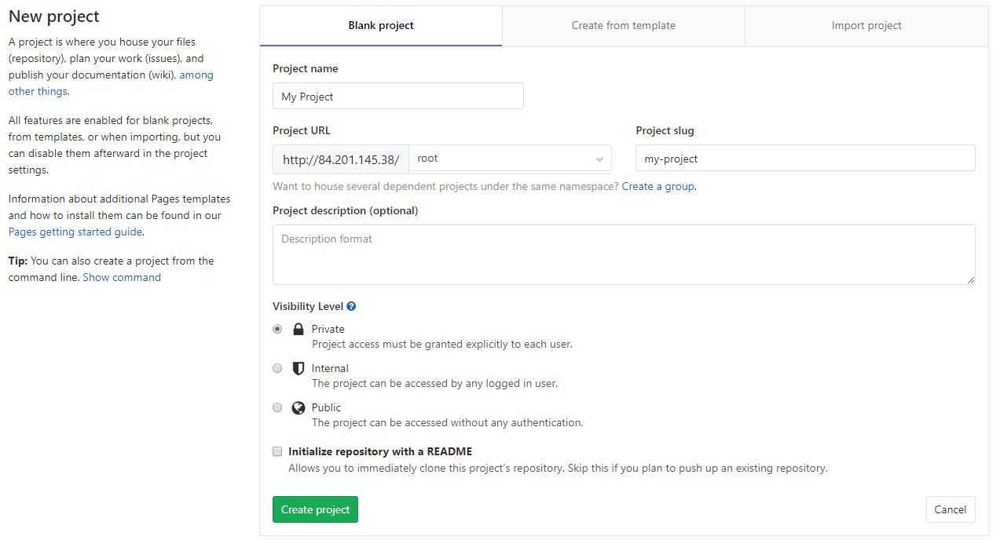
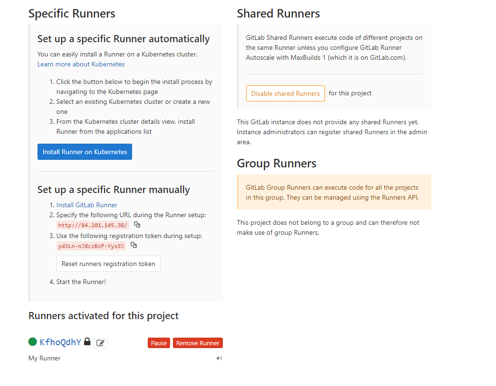
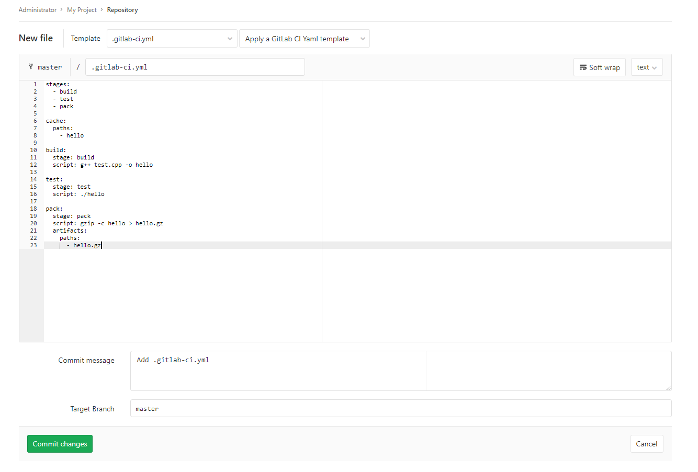
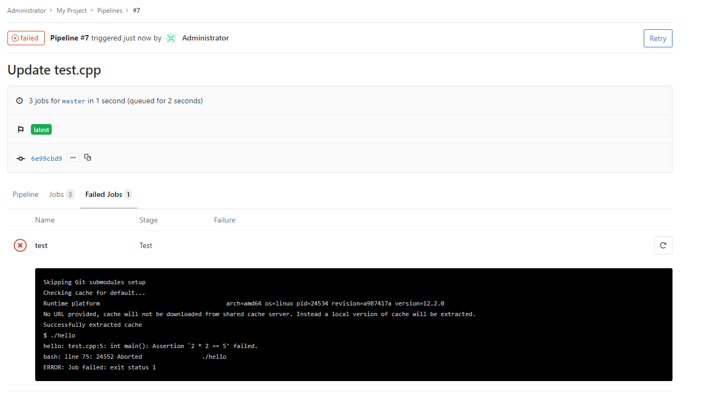

# Testing applications with {{ GL }}

[{{ GL }}](https://about.gitlab.com/) is a web-based Git repository management site and system. {{ GL }} also lets developers run a continuous process for writing, testing, and deploying code.

In this scenario, you will set up {{ GL }} on a [virtual machine](../../compute/concepts/vm.md), create a single project in the C++ programming language, configure a project test script, and test its execution.

To create and test a project in the {{ GL }} environment:
1. [Prepare your cloud](#before-you-begin).


1. [Required paid resources](#paid-resources).


1. [Create a VM with {{ GL }}](#create-vm).
1. [Configure {{ GL }}](#confgure-gitlab).
1. [Set privacy settings](#disable-signup).
1. [Create a project](#create-project).
1. [Set up and run testing for the project](#ci-cd).
1. [Configure and register a Runner](#configure-runner).
1. [Create a test scenario](#create-test-case).
1. [Create an error in the project](#create).
1. [How to delete the resources you created](#clear-out).

## Prepare your cloud {#before-you-begin}




### Required paid resources {#paid-resources}

The cost for maintaining a {{ GL }} server includes:
* Fee for a [disk](../../compute/concepts/disk.md) and a continuously running VM (see [{{ compute-full-name }} pricing](../../compute/pricing.md)).
* Fee for using a dynamic or static [public IP address](../../vpc/concepts/address.md#public-addresses) (see [{{ vpc-full-name }} pricing](../../vpc/pricing.md)).


## Create a VM with {{ GL }} {#create-vm}

1. On the [folder page](../../resource-manager/concepts/resources-hierarchy.md#folder) in the [management console]({{ link-console-main }}), click **{{ ui-key.yacloud.iam.folder.dashboard.button_add }}** and select `{{ ui-key.yacloud.iam.folder.dashboard.value_compute }}`.
1. Under **{{ ui-key.yacloud.compute.instances.create.section_image }}**, in the **{{ ui-key.yacloud.compute.instances.create.placeholder_search_marketplace-product }}** field, enter `Gitlab` and select a public [{{ GL }}](/marketplace/products/yc/gitlab) image.
1. Under **{{ ui-key.yacloud.k8s.node-groups.create.section_allocation-policy }}**, select the [availability zone](../../overview/concepts/geo-scope.md) to create your VM in. If you do not know which availability zone you need, leave the default one.
1. Under **{{ ui-key.yacloud.compute.instances.create.section_storages }}**, select the `{{ ui-key.yacloud.compute.value_disk-type-network-ssd }}` [disk type](../../compute/concepts/disk.md#disks_types) and set the `20 {{ ui-key.yacloud.common.units.label_gigabyte }}` size.
1. Under **{{ ui-key.yacloud.compute.instances.create.section_platform }}**, navigate to the `{{ ui-key.yacloud.component.compute.resources.label_tab-custom }}` tab and specify the required [platform](../../compute/concepts/vm-platforms.md), number of vCPUs, and amount of RAM:

    * **{{ ui-key.yacloud.component.compute.resources.field_platform }}**: `Intel Ice Lake`.
    * **{{ ui-key.yacloud.component.compute.resources.field_cores }}**: `4`.
    * **{{ ui-key.yacloud.component.compute.resources.field_core-fraction }}**: `100%`
    * **{{ ui-key.yacloud.component.compute.resources.field_memory }}**: `8 {{ ui-key.yacloud.common.units.label_gigabyte }}`.

1. Under **{{ ui-key.yacloud.compute.instances.create.section_network }}**:

    * In the **{{ ui-key.yacloud.component.compute.network-select.field_subnetwork }}** field, select the network and subnet to connect your VM to. If the required [network](../../vpc/concepts/network.md#network) or [subnet](../../vpc/concepts/network.md#subnet) is not listed, [create it](../../vpc/operations/subnet-create.md).
    * Under **{{ ui-key.yacloud.component.compute.network-select.field_external }}**, keep `{{ ui-key.yacloud.component.compute.network-select.switch_auto }}` to assign your VM a random external IP address from the {{ yandex-cloud }} pool or select a static address from the list if you reserved one in advance.

1. Under **{{ ui-key.yacloud.compute.instances.create.section_access }}**, select **{{ ui-key.yacloud.compute.instance.access-method.label_oslogin-control-ssh-option-title }}** and specify the access credentials for the VM:

    * Under **{{ ui-key.yacloud.compute.instances.create.field_user }}**, enter the username. Do not use `root` or other names reserved by the OS. To perform operations requiring superuser permissions, use the `sudo` command.
    * 

1. Under **{{ ui-key.yacloud.compute.instances.create.section_base }}**, specify the VM name: `gitlab`.
1. Click **{{ ui-key.yacloud.compute.instances.create.button_create }}**.

Wait about five minutes for the VM to be created and for all its services to start. After all of the services fully launch, {{ GL }} will become available through its web interface in the browser.

## Configure {{ GL }} {#confgure-gitlab}

1. On the {{ compute-name }} page, select the created VM named `gitlab` and copy its public IP address.
1. [Connect](../../compute/operations/vm-connect/ssh.md#vm-connect) to the VM via SSH.
1. Get the {{ GL }} administrator password using the following VM command:

   ```bash
   sudo cat /etc/gitlab/initial_root_password
   ```

1. Copy the password (without spaces) from the `Password` row to the clipboard or a separate file.
1. Open `http://<VM_public_IP_address>` in your browser. This will take you to the {{ GL }} web interface.
1. Log in using the administrator account:
   * **Username or email**: `root`.
   * **Password**: Password you copied earlier.

   If you are unable to log in, [reset the administrator account password](https://docs.gitlab.com/ee/security/reset_user_password.html#reset-your-root-password).
1. [Change the administrator account password](https://docs.gitlab.com/ee/user/profile/#change-your-password).
1. Log in to the system again using the administrator account and the new password.

### Set privacy settings {#disable-signup}

Disable sign-up for other users on the login page:
1. Go to **Admin area**.
1. In the left-hand panel, go to **Settings** and select **General**.
1. Under **Sign-up restrictions**, click **Expand**.
1. Disable **Sign-up enabled**.
1. Click **Save changes**.

Now, only the administrator can register a new user from the **Users** tab in **Overview**.

## Create a project {#create-project}

To create a project:
1. On the {{ GL }} home page, select **Create a project**.
1. On the page that opens, specify:
   * Project name: `My Project`.
   * Project group and project ID: `root` and `my-project`, respectively.
   * Set a description and the scope of the project if required.
1. Click **Create project**.

   

1. Once you create the project, in the left-hand panel, go to **Settings** and select the **CI/CD** tab.
1. Under **Auto DevOps**, click **Expand**, disable **Default to Auto DevOps pipeline**, and click **Save changes**.

   

1. Add a project file.
   1. In the left-hand panel, go to the {{ GL }} project.
   1. Click  in the repository navigation bar and select **New file** from the drop-down menu.
   1. Name your file `test.cpp`. Add into it the code of the program that checks the product of 2 × 2 and displays `Hello World` if the result is 4:

      ```cpp
      #include <iostream>
      #include <cassert>

      int main() {
        assert(2 * 2 == 4);
        std::cout << "Hello world!" << std::endl;
        return 0;
      }
      ```

      

   1. Enter a commit name in the **Commit message** field.
   1. Click **Commit changes**.

## Set up and run testing for the project {#ci-cd}

A Runner is a program that tests and builds projects in the {{ GL }} environment by following provided instructions.

### Configure and register a Runner {#configure-runner}

1. [Use SSH to connect](../../compute/operations/vm-connect/ssh.md#vm-connect) to the VM and change to administrator mode in the console:

   ```bash
   sudo -i
   ```

1. Download the Runner:

   ```bash
   curl --location --output /usr/local/bin/gitlab-runner https://gitlab-runner-downloads.s3.amazonaws.com/latest/binaries/gitlab-runner-linux-amd64
   ```

1. Make the Runner executable:

   ```bash
   chmod +x /usr/local/bin/gitlab-runner
   ```

1. Create a separate user to start the Runner:

   ```bash
   useradd --comment 'GitLab Runner' --create-home gitlab-runner --shell /bin/bash
   ```

1. Install and start the Runner:

   ```bash
   gitlab-runner install --user=gitlab-runner --working-directory=/home/gitlab-runner
   gitlab-runner start
   ```

1. Register the Runner in {{ GL }}:
   1. Launch interactive registration with the `gitlab-runner register` command.
   1. Enter your {{ GL }} server address. When you see the prompt:

      ```text
      Please enter the gitlab-ci coordinator URL (e.g. https://gitlab.com)
      ```

      enter `http://<public_IP_address_of_your_VM>`.
   1. Enter the registration token for the Runner. To retrieve it, go to the project page in {{ GL }}, select **Settings** on the left-hand panel, and click the **CI/CD** tab. Then click **Expand** under **Runners**. Under **Set up a specific Runner manually**, copy the token from step 3 and enter it in the request response:

      ```text
      Please enter the gitlab-ci token for this runner
      <token>
      ```

      

   1. When you see the prompt:

      ```text
      Please enter the gitlab-ci description for this runner
      ```

      Enter a description for the Runner: `My runner`.
   1. Do not specify anything in the tag field, just press **Enter**. Otherwise, by default, the Runner will not run without specifying the appropriate tags for the project.
   1. Specify the runtime environment. In our case, when prompted:

      ```text
      Please enter the executor: ssh, docker+machine, docker-ssh+machine, kubernetes, docker, parallels, virtualbox, docker-ssh, shell:
      ```

      Enter: `shell`.

Runner installation and setup is complete. If everything is done correctly, the **Runners activated for this project** section with the registered Runner should appear on the page where you copied the registration token.



### Create a test scenario {#create-test-case}

Create a test scenario to execute the Runner. The scenario is described in a special file named `.gitlab-ci.yml`, which should be stored in the project's root directory. According to the scenario, the Runner will compile the project source file, convert it to an executable file, and then run it.

As testing will take place on the VM operating system, you need to install the apps required for testing: `git` to clone the project from the repository and `g++` to compile the project.

To create a test scenario:
1. Connect to the VM via SSH and install the required apps:

   ```bash
   sudo apt update
   sudo apt install -y git g++
   ```

1. Add a test scenario:
   1. Open the {{ GL }} web interface.
   1. Open the {{ GL }} project.
   1. On the page that opens, click **Set up CI/CD**.
   1. A page will open asking you to add a new file named `.gitlab-ci.yml`, in which you need to describe the scenario in [YAML](https://yaml.org/) format. Add the scenario text:

      ```yaml
      stages:
        - build
        - test
        - pack

      cache:
        paths:
          - hello

      build:
        stage: build
        script: g++ test.cpp -o hello

      test:
        stage: test
        script: ./hello

      pack:
        stage: pack
        script: gzip -c hello > hello.gz
        artifacts:
          paths:
            - hello.gz
      ```

      The scenario indicates that the process is divided into three stages that are performed sequentially:
      * `build`: At the first stage, the project is compiled and converted to an executable file named `hello`.
      * `test`: At the second stage, the executable file is run.
      * `pack`: At the third stage, an archive with the executable file is created, which you can download via the {{ GL }} web interface after the scenario is successfully completed. Under `artifacts`, there is a list of files available for download.

      Under `cache`, specify which files and directories are to be transferred between stages. If you omit it, the `hello` file will not be available at the `test` stage and an error will occur.

      

   1. Click **Commit changes**

After committing, the system will automatically start testing the last commit. To check its results, select **Build** on the left-hand panel in the {{ GL }} project and then **Pipelines** from the drop-down menu. The line you will get should contain the first test with the `passed` status. By clicking the cloud icon, you can download the build artifacts.

### Create an error in the project {#create}

Now, make the project run with an error that the Runner should help you find during testing. To do this:
1. Go to the project repository and open the `test.cpp` file.
1. Click **Edit**.
1. In the check, assert that the product of multiplying 2 x 2 should be 5. In this case, an error occurs when the program is run and it fails.

   ```cpp
   ...
   assert(2 * 2 == 5);
   ...
   ```

1. Name your commit: `Wrong assert in test.cpp`.
1. Click **Commit Changes**.

Open **Build** → **Pipelines**. In the **Stages** column, you can see that, as a result of the test, the first stage, `build`, was passed successfully and the second stage, `test`, returned an error. The third stage, `pack`, was skipped and the build artifacts were not generated.

If you click the `failed` progress status and go to **Failed Jobs**, you can see the error text saying that `assert` was not executed:



## How to delete the resources you created {#clear-out}

To stop paying for your deployed server, it is enough to delete the `gitlab` VM you created.

If you reserved a static public IP address specifically for this VM:
1. Select **{{ ui-key.yacloud.iam.folder.dashboard.label_vpc }}** in your folder.
1. Go to the **{{ ui-key.yacloud.vpc.switch_addresses }}** tab.
1. Find the required address, click , and select **{{ ui-key.yacloud.common.delete }}**.
