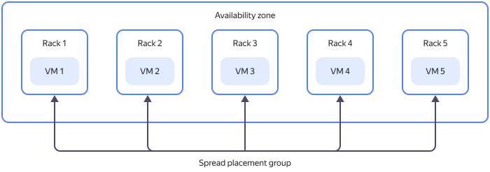
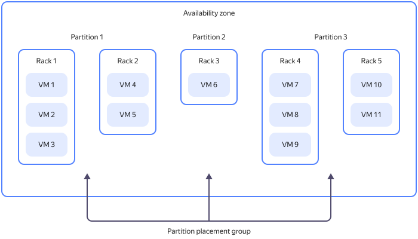

# VM placement groups

Once VMs are created, they are automatically distributed across the {{ yandex-cloud }} physical infrastructure. To manage hardware fault tolerance levels, you can combine your VMs into placement groups.

_VM placement groups_ are groups of VMs, where each one is hosted on physical hardware according to a certain strategy. {{ compute-full-name }} uses the [spread placement](#spread) and [partition placement](#partition) strategies.

To learn about the limits on the number of VM placement groups, see [Quotas](../concepts/limits.md#compute-quotas).

## Spread placement {#spread}

_Spread placement_ is a VM placement strategy ensuring that each instance is hosted on a separate server rack in one of the [availability zones](../../overview/concepts/geo-scope.md). If one rack fails, the others continue to run normally.

By grouping VMs based on the spread placement strategy, you can ensure a high level of fault tolerance and reduce the risk of concurrent failure of VMs hosted on the same server rack. However, the placement requirements are more demanding, so a physical resource shortage is more likely for VMs in a placement group rather than for the same number of ungrouped VMs.

To learn about the limits on the number of VMs per group with the spread placement strategy, see [{#T}](../concepts/limits.md#compute-limits-vm).

You can manage VM placement groups that follow the spread placement strategy using the [management console](../../console/), [CLI](../../cli/quickstart.md), [{{ TF }}](../../tutorials/infrastructure-management/terraform-quickstart.md), or [API](../api-ref/).

## Partition placement {#partition}

_Partition placement_ is a VM placement strategy that ensures that VMs from different partitions reside on different server racks in the data center of one of the availability zones. If one of the server racks hosting the group partitions fails, only one partition will be affected.

A single placement group may contain up to 5 partitions. To learn about the limits on the number of VMs per partition, see [Quotas](../concepts/limits.md#compute-quotas).

You can manage placement groups that follow the partition placement strategy using the [CLI](../../cli/quickstart.md) and [API](../api-ref/).

## See also {#see-also}

* [How to create a placement group](../operations/placement-groups/create.md)
* [How to add a VM instance to a placement group](../operations/placement-groups/add-vm.md)
* [How to create a VM in a placement group](../operations/placement-groups/create-vm-in-pg.md)