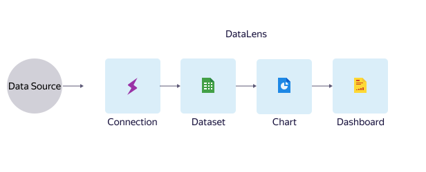

# About {{ datalens-full-name }}

{{ datalens-full-name }} is a business analytics service. allows you to connect to various data sources, visualize data, create dashboards, and share your results.
With {{ datalens-full-name }}, you can track your product and business metrics directly from data sources to make data-driven decisions.



The maximum number of {{ datalens-short-name }} instances per {{ yandex-cloud }} [organization](../../organization/quickstart.md) or [cloud](../../resource-manager/concepts/resources-hierarchy.md#cloud) is one.



## Relationship between entities {#component-interrelation}

{{ datalens-short-name }} consists of multiple entities that ensure full data cycle.

{{ datalens-short-name }} includes the following entities:

- **Connection**: Parameters for accessing a data source.
- **Dataset**: Description of a dataset from a source.
- **Chart**: Data from a data source or a dataset visualized as tables, diagrams, or maps.
- **Dashboard**: Charts, selectors for data filtering, and text blocks.

You can create the entity objects yourself or use ready-made solutions from [{{ datalens-short-name }} Marketplace](marketplace.md).

