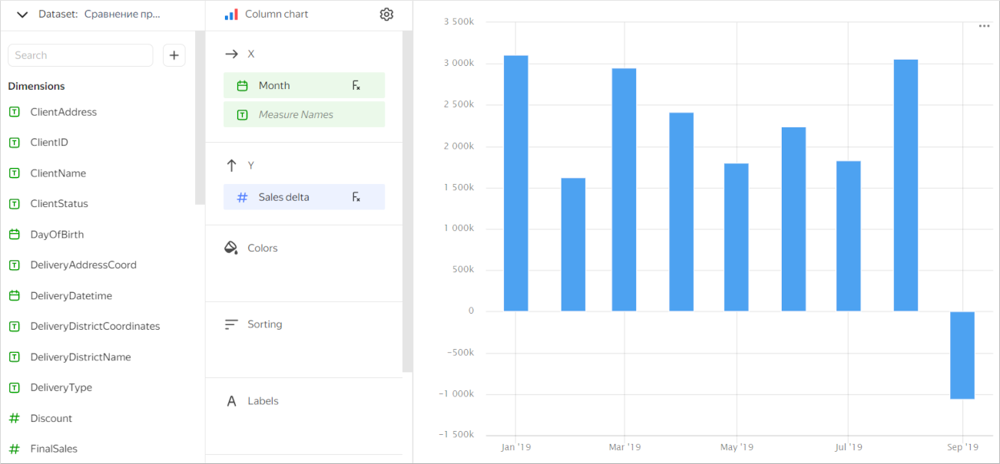
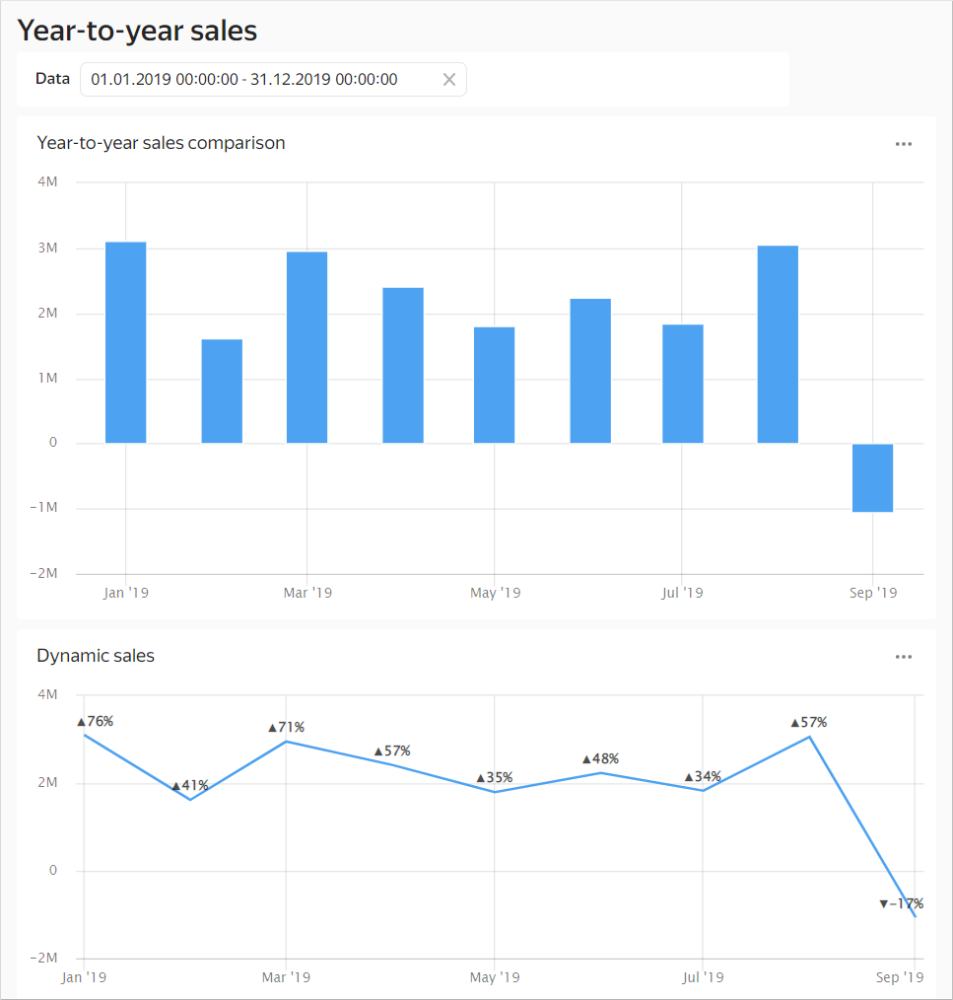

# Functions for time series

This section describes how to use the [time series functions](../function-ref/time-series-functions.md) based on the [{#T}](../function-ref/AGO.md) function example. This function calculates measure values for past or future periods.

We will use a Moscow retail chain's demo sales {{ CH }} database as our data source.

To access the demo database, create a direct [connection](../tutorials/data-from-ch-to-sql-chart.md#create-connection) to it.

Create a dataset based on the **MS_SalesFullTable** table:

1. Set the **Sum** aggregation type for the **Sales** field:
1. Add these [calculated fields](../dataset/create-dataset.md#create-fields) to the dataset:

   * `Month`, with the `DATETRUNC([OrderDatetime], "month")` formula. This field shows the sales date rounded to a month.
   * `Sales last year`, with the `AGO([Sales], [Month], "year", 1 BEFORE FILTER BY [OrderDatetime])` formula. This formula enables you to get the **Sales** metric volume shifted along the **Month** dimension by one year. The `BEFORE FILTER BY` argument means that the function is calculated before filtering by the **OrderDatetime** field in the chart.
   * `Sales delta`, with the `[Sales]-[Sales last year]` formula. This field shows a change in the sales amount compared to the previous year.
   * `Sales dynamics`, with the `([Sales] - [Sales last year]) / [Sales last year]` formula. This field shows sales dynamics compared to the previous year.
   * `Changes`, with the `IF([Sales dynamics] > 0, CONCAT("▲", CEILING([Sales dynamics] * 100), "%"), CONCAT("▼", CEILING([Sales dynamics] * 100), "%"))` formula. If the sales dynamics is positive, the field shows the `▲` icon and the sales amount percentage change. Otherwise, the field shows the `▼` icon and the sales amount percentage change.

You can use the `Sales last year` field created using the `AGO` time function, as well as its derived fields, to create charts to compare year-on-year sales changes.

**Example 1**

Create a chart to output metrics of sales growth compared to the previous year.

1. Create a [bar chart](../visualization-ref/column-chart.md).
1. Drag the **Month** dimension to the **X** section.
1. Drag the **Sales delta** measure to the **Y** section.

**Example 2**

Create a chart to show the sales dynamics compared to the previous year.

1. Create a [line chart](../visualization-ref/line-chart.md).
1. Drag the **Sales delta** measure to the **Y** section.
1. In the **Sales delta** field settings, select the **Auto** dimension.
1. In the **Y** axis settings for the **Axis format** parameter, select **By the first field on the Y axis**.
1. Drag the **Changes** measure to the **Labels** section.

You can add both charts to the dashboard to compare the absolute and percentage changes in your sales year-on-year.

