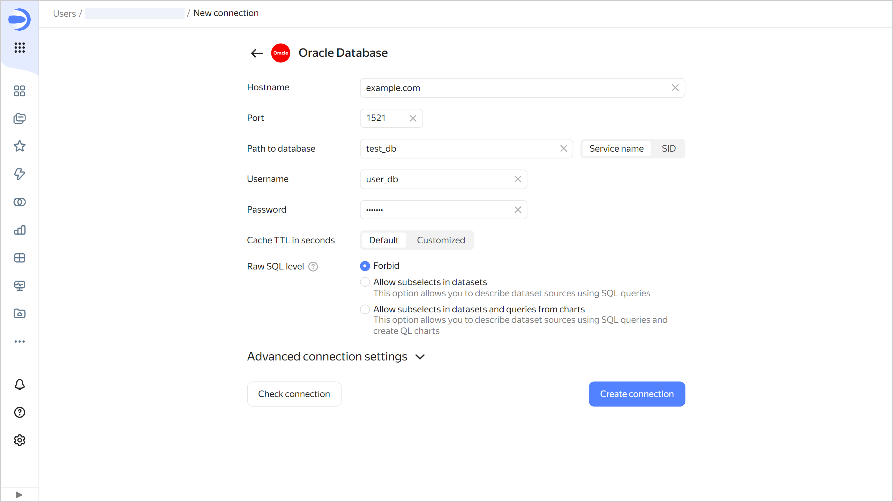

# Creating an Oracle Database connection







To create an Oracle Database connection:

1. Open the page for [creating a new connection]({{ link-datalens-main }}/connections/new).
1. Under **Databases**, selec the **Oracle Database** connection.
1. Specify the connection parameters:

   * **Hostname**. Specify the path to the master host or the IP address of the Oracle Database master host. You can specify multiple hosts in a comma-separated list. If you are unable to connect to the first host, {{ datalens-short-name }} will select the next one from the list.
   * **Port**. Specify the Oracle Database connection port. The default port is 1521.
   * **Path to database**. Specify the service name or the system ID of the database to connect and select the **Service name** or **SID** option, respectively.
   * **Username**. Specify the username for the Oracle Database connection.
   * **Password**. Enter the password for the specified user.
   * **Cache TTL in seconds**. Specify the cache time-to-live or leave the default value. The recommended value is 300 seconds (5 minutes).
   * **Raw SQL level**. Enables you to use an ad-hoc SQL query to [generate a dataset](../../dataset/settings.md#sql-request-in-datatset).

   

1. (Optional) Test the connection. To do this, click **Check connection**.
1. Click **Create connection**.

1. Select a [workbook](../../workbooks-collections/index.md) to save your connection to or create a new one. If using legacy folder navigation, select a folder to save the connection to. Click **Create**.

1. Enter a name for the connection and click **Create**.

## Additional settings {#additional-settings}


