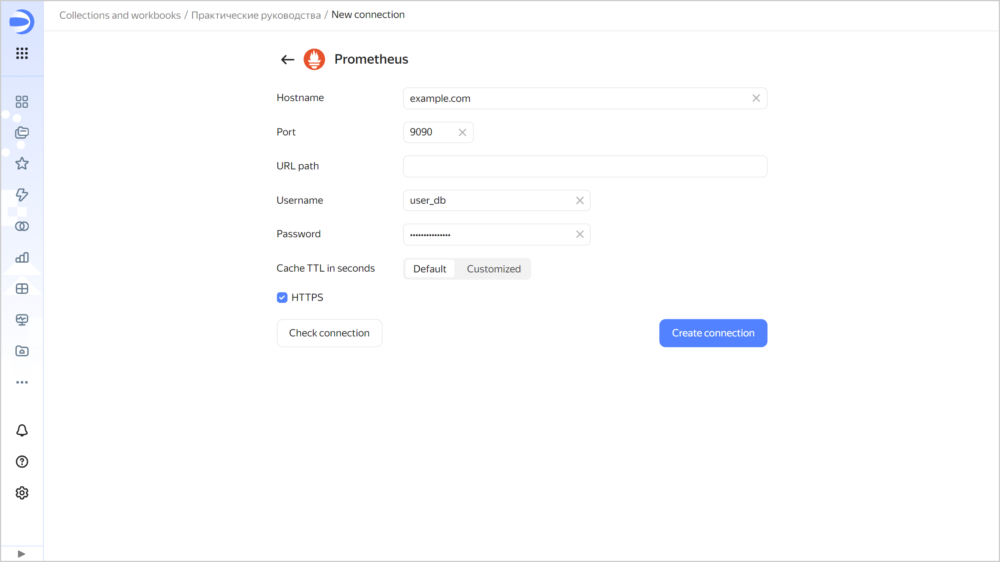

# Creating a {{ prometheus-name }} connection

To create a {{ prometheus-name }} connection:

1. Open the page for [creating a new connection]({{ link-datalens-main }}/connections/new).
1. Under **Databases**, select the **{{ prometheus-name }}** connection.
1. Specify the connection parameters:

   * **Hostname**. Specify the path to the {{ prometheus-name }} host. You can specify multiple hosts in a comma-separated list. If you are unable to connect to the first host, {{ datalens-short-name }} will select the next one from the list.
   * **Port**. Specify the {{ prometheus-name }} connection port.
   * **URL path**. (Optional) Specify the path to the {{ prometheus-name }} API (part of the [URL](https://developer.mozilla.org/en-US/docs/Learn/Common_questions/Web_mechanics/What_is_a_URL) without a protocol, host name, and port).
   * **Username**. Specify the username for the {{ prometheus-name }} connection.
   * **Password**. Enter the password for the user.
   * **Cache TTL in seconds**. Specify the cache time-to-live or leave the default value. The recommended value is 300 seconds (5 minutes).
   * **HTTPS**. Enable the secure connection option if your server supports HTTPS.

   

1. (Optional) Test the connection. To do this, click **Check connection**.
1. Click **Create connection**.

1. Select a [workbook](../../workbooks-collections/index.md) to save your connection to or create a new one. If using legacy folder navigation, select a folder to save the connection to. Click **Create**.

1. Enter a name for the connection and click **Create**.
