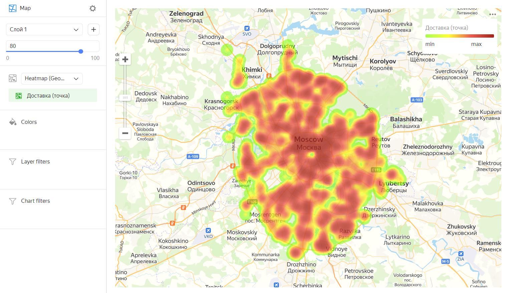

# Heat map 

A heat map shows the density of point distribution. Map areas are colored with a gradient ranging from green to red: the more points are grouped in an area, the closer its color is to red. Heat maps are used to display concentrations of a large number of points.

A heat map is most effective when working with a dataset that contains a lot of points located within a small geographic area. If there are few points on a map, their fill intensity can be indicated by a measure value: the higher the value, the closer the point color to red.

A heat map helps find dependencies that can be hidden due to overlapping map points (like on a [point](point-map-chart.md) map). For example, you can use a heat map to determine the districts where customers order for delivery most often.

## Wizard sections {#wizard-sections}

Section  section| Description
----- | ----
Heat map (Geopoints) | Measure of the [Geopoint](../dataset/data-types#geopoint) type
Colors  | Dimension or measure. Affects the intensity of point fill.
Layer filters | Dimension or measure. Used as a filter for the current layer.
Filters | Dimension or measure. Used as a filter for the entire chart.

## Creating a heat map {#create-diagram}



1. Go to the {{ datalens-short-name }} [home page]({{ link-datalens-main }}).
1. In the left-hand panel, select  **Charts**.
1. Click **Create chart** → **Chart**.
1. At the top left, click  **Select dataset** and specify the dataset to visualize. If you do not have a dataset, [create one](../dataset/create-dataset.md#create).
1. Select **Map** for chart type.
1. Select the **Heat map (Geopoints)** layer type.
1. Drag a dimension of the [Geopoint](../dataset/data-types.md#geopoint) type from the dataset to the layer type selection section.
1. Change the weight of the points on the heat map. To do this, drag the measure to the **Colors** section.

You can also:

* Add, rename, and delete a layer.
* Apply a filter to the whole chart or one layer.

## Recommendations {#recomendations}

* Use a heat map if there are a lot of points in your dataset. If there are few points, using this type of map may distort the detected dependencies.
* The intensity of point and area fill on a heat map varies depending on the map's scale. Please keep this in mind.

#### See also {#see-also}

* [{#T}](../operations/dashboard/create.md)
* [{#T}](../operations/dashboard/add-chart.md)
* [{#T}](../operations/dashboard/add-selector.md)