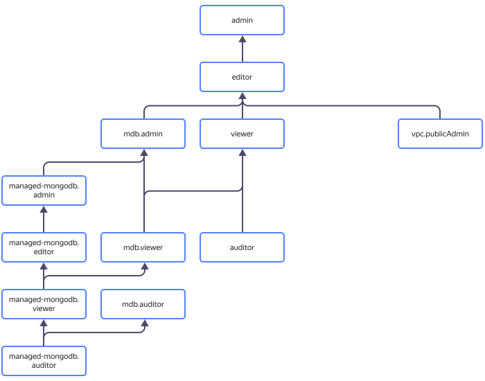

# Access management in {{ mmg-name }}

In this section, you will learn:

* [Which resources you can assign a role for](#resources).
* [Which roles exist in the service](#roles-list).
* [Which roles are required](#required-roles) for particular actions.



Roles for a resource can be assigned by users who have the `mdb.admin`, `managed-mongodb.admin`, or one of the following roles for that resource:



## Which resources you can assign a role for {#resources}





## Which roles exist in the service {#roles-list}

The chart below shows which roles are available in the service and how they inherit each other's permissions. For example, the `{{ roles-editor }}` role includes all the permissions of `{{ roles-viewer }}`. You can find the description of each role under the chart.

### Service roles {#service-roles}

#### managed-mongodb.auditor {#managed-mongodb-auditor}



#### managed-mongodb.viewer {#managed-mongodb-viewer}



#### managed-mongodb.editor {#managed-mongodb-editor}



#### managed-mongodb.admin {#managed-mongodb-admin}



#### mdb.auditor {#mdb-auditor}



#### mdb.viewer {#mdb-viewer}



#### mdb.admin {#mdb-admin}



#### vpc.publicAdmin {#vpc-public-admin}



### Primitive roles {#primitive-roles}





## Roles required {#required-roles}

To use the service, you need the [{{ roles.mmg.editor }} role](../../iam/concepts/access-control/roles.md) or higher for the folder to house the new cluster. The `{{ roles.mmg.viewer }}` role enables you only to view the list of clusters.

To create a {{ mmg-name }} cluster, you need the [{{ roles-vpc-user }}](../../vpc/security/index.md#vpc-user) role and the `{{ roles.mmg.editor }}` role or higher.

You can always assign a role with more permissions. For example, you can assign the `{{ roles.mmg.admin }}` role instead of `{{ roles.mmg.editor }}`.

## What's next {#whats-next}

* [How to assign a role](../../iam/operations/roles/grant.md).
* [How to revoke a role](../../iam/operations/roles/revoke.md).
* [Learn more about access management in {{ yandex-cloud }}](../../iam/concepts/access-control/index.md).
* [Learn more about inheriting roles](../../resource-manager/concepts/resources-hierarchy.md#access-rights-inheritance).

