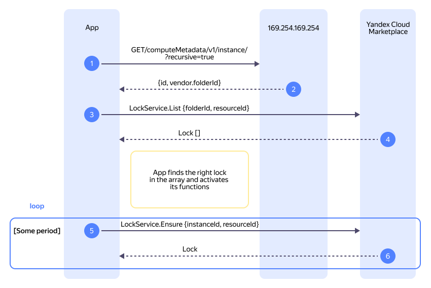

# Getting started with the {{ marketplace-short-name }} {{ license-manager }} API

In this section, you will learn how to integrate your [product](../../concepts/product.md) with the {{ marketplace-full-name }} {{ license-manager }} API.

## API interaction diagram {#visualization}




On the diagram:

1. The application [requests](#get-metadata) VM metadata. The metadata service address accessible from within the VM is used for this purpose.
1. In [response](#metadata-response), the application gets the `id` and `vendor.folderId` field values. These values ​​are used to get a list of links.
1. The application [requests](#get-locks) the {{ marketplace-short-name }} {{ license-manager }} API for a list of links, providing the obtained `resourceId` and `folderId` field values ​​as parameters.
1. In [response](#lock-list-response), the application gets an array of links, selects the required one, and uses it to activate some functionality.
1. From time to time, the application [requests](#ensure-lock) a confirmation of the link to the resource.
1. In [response](#lock-ensured), the application gets the link confirmed and continues to operate.

## Getting started {#before-you-begin}

To get started with the {{ marketplace-short-name }} {{ license-manager }} API:




## Set up integration with API {#integrate}

To implement your product's business logic, update your app code by [setting up integration](../../operations/license-manager-integration.md) with the {{ license-manager }} API to enable subscription status and type checks.


### Request the VM metadata {#get-metadata}

1. [Connect](../../../compute/operations/vm-connect/ssh.md) to the VM hosting your product.
1. In the VM terminal, run this command:

    ```bash
    curl \
      --header Metadata-Flavor:Google \
      169.254.169.254/computeMetadata/v1/instance/?recursive=true
    ```

    Where `169.254.169.254` is the address of the metadata service accessible from inside the VM.

    Result:
    {#metadata-response}
    ```json
    {
      "attributes": {
        "install-unified-agent": "0",
        "serial-port-enable": "0",
        "ssh-keys": "user1:ssh-rsa ABC...",
        "user-data": "#cloud-config\ndatasource:\n Ec2:\n  strict_id: false\nssh_pwauth: no\nusers:\n- name: user1\n  sudo: ALL=(ALL) NOPASSWD:ALL\n  shell: /bin/bash\n  ssh_authorized_keys:\n  - ssh-rsa ABC..."
      },
      "description": "",
      "disks": [
        {
          "deviceName": "epdjv70ebov2********",
          "index": 0,
          "mode": "READ_WRITE",
          "type": "PERSISTENT"
        }
      ],
      "hostname": "compute-vm.ru-central1.internal",
      "id": "epdg9mn1pd9j********",
      "maintenanceEvent": "NONE",
      "name": "compute-vm",
      "networkInterfaces": [
        {
          "accessConfigs": [
            {
              "externalIp": "158.160.**.***",
              "type": "ONE_TO_ONE_NAT"
            }
          ],
          "forwardedIps": [],
          "ip": "10.12*.*.*",
          "mac": "d0:0d:10:4d:**:**",
          "network": "e2lb1da2dd9v********",
          "targetInstanceIps": []
        }
      ],
      "serviceAccounts": {},
      "tags": [],
      "vendor": {
        "cloudId": "b1gia87mbaom********",
        "environment": "ru-central1",
        "folderId": "b1g681qpemb4********",
        "identity": {
          "base64": "VPb...",
          "document": "{\"instanceId\":\"epdg9mn1pd9j********\",\"productCodes\":null,\"imageId\":\"fd8hp9las7k4********\",\"productIds\":[\"f2egeq0c2kd6********\"],\"createdAt\":\"2024-11-13T13:33:42Z\",\"version\":\"2023-03-01\"}",
          "dsa": "-----BEGIN PKCS7-----\nMI...\n-----END PKCS7-----\n",
          "rsa": "-----BEGIN PKCS7-----\nMI...-----END PKCS7-----\n"
        },
        "labels": {}
      },
      "virtualClock": {
        "driftToken": 0
      },
      "zone": "projects/b1g681qpemb4********/zones/ru-central1-b"
    }
    ```

    Save the values of the `id` and `vendor.folderId` fields. You will need them to request a list of links.


### Get a list of links {#get-locks}

To get a list of links of subscriptions to resources, use the [List](../api-ref/Lock/list.md) REST API method for the [Lock](../api-ref/Lock/index.md) resource or the [LockService/List](../api-ref/grpc/Lock/list.md) gRPC API call.



- REST API {#api}

  ```bash
  curl \
    --request GET \
    --url 'https://marketplace.{{ api-host }}/marketplace/license-manager/v1/locks?folderId=<folder_ID>&resourceId=<resource_ID>' \
    --header 'Authorization: Bearer <IAM_token>' \
    --header 'Content-Type: application/json'
  ```

  Where:

  * `folderId`: ID of the folder the resource is located in. Matches the `vendor.folderId` field value obtained in the previous step.
  * `resourceId`: Resource ID. Matches the `id` field value obtained in the previous step.

- gRPC API {#grpc-api}

  ```bash
  grpcurl \
    -rpc-header "Authorization: Bearer <IAM_token>" \
    -d '{
        "folderId": "<folder_ID>",
        "resourceId": "<resource_ID>"
    }' \
    marketplace.{{ api-host }}:443 yandex.cloud.marketplace.licensemanager.v1.LockService/List
  ```

  Where:

  * `folderId`: ID of the folder the resource is located in. Matches the `vendor.folderId` field value obtained in the previous step.
  * `resourceId`: Resource ID. Matches the `id` field value obtained in the previous step.



Result:
{#lock-list-response}
```json
{
  "locks": [
    {
      "id": "enp0asmd9pr9********",
      "instanceId": "epdg9mn1pd9j********",
      "resourceId": "epdg9mn1pd9j********",
      "startTime": "2024-01-01T12:34:56.123456789Z",
      "endTime": "2024-01-01T13:34:56.123456789Z",
      "createdAt": "2024-01-01T12:34:56.123456789Z",
      "state": "LOCKED",
      "templateId": "enpbhhpl3vs5********"
    }
  ]
} 
```

Save the values of the `instanceId` and `resourceId` fields. You will need them to link your subscription to the resource.


### Request a link to the resource {#ensure-lock}

To link a subscription to a resource and to make sure it is linked to a resource, use the [Ensure](../api-ref/Lock/ensure.md) REST API method for the [Lock](../api-ref/Lock/index.md) resource or the [LockService/Ensure](../api-ref/grpc/Lock/ensure.md) gRPC API call.



- REST API {#api}

  ```bash
  curl \
    --request POST \
    --url 'https://marketplace.{{ api-host }}/marketplace/license-manager/v1/locks/<instance_ID>:ensure' \
    --header 'Authorization: Bearer <IAM_token>' \
    --header 'Content-Type: application/json' \
    --data '{
        "resourceId": "<resource_ID>"
    }'
  ```

  Where:

  * `<instance_ID>`: `instanceId` field value obtained at the previous step.
  * `resourceId`: `resourceId` field value obtained at the previous step.

- gRPC API {#grpc-api}

  ```bash
  grpcurl \
    -rpc-header "Authorization: Bearer <IAM_token>" \
    -d '{
        "instanceId": "<instance_ID>",
        "resourceId": "<resource_ID>"
    }' \
    marketplace.{{ api-host }}:443 yandex.cloud.marketplace.licensemanager.v1.LockService/Ensure
  ```

  Where:

  * `instanceId`: `instanceId` field value obtained at the previous step.
  * `resourceId`: `resourceId` field value obtained at the previous step.



Result:
{#lock-ensured}
```json
{
  "id": "e2371l9d5u8a********",
  "description": "lock ensured",
  "done": true,
  "metadata": {
    "@type": "type.googleapis.com/yandex.cloud.marketplace.licensemanager.v1.EnsureLockMetadata",
    "lockId": "enp0asmd9pr9********"
  },
  "response": {
    "@type": "type.googleapis.com/yandex.cloud.marketplace.licensemanager.v1.Lock",
    "id": "enp0asmd9pr9********",
    "instanceId": "epdg9mn1pd9j********",
    "resourceId": "epdg9mn1pd9j********",
    "startTime": "2024-01-01T12:34:56.123456789Z",
    "endTime": "2024-01-01T13:34:56.123456789Z",
    "createdAt": "2024-01-01T12:34:56.123456789Z",
    "state": "LOCKED",
    "templateId": "enpbhhpl3vs5********"
  }
}
```

As a result, the service will link the subscription to the resource. If the subscription is already linked, the service will simply confirm the link.