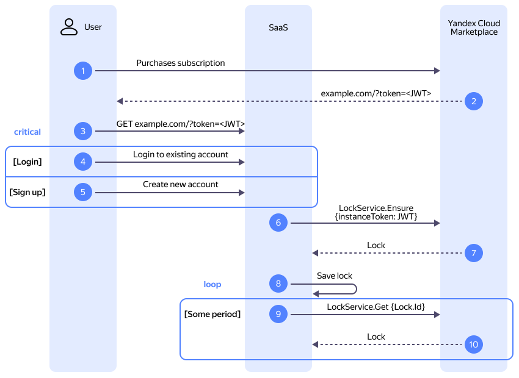

# Getting started with the {{ marketplace-short-name }} {{ license-manager }} SaaS API

In this section, you will learn how to integrate your SaaS [product](../../../concepts/product.md) with the {{ marketplace-full-name }} {{ license-manager }} SaaS API.

## API interaction diagram {#visualization}




On the diagram:

1. The user purchases a subscription to a SaaS product in {{ marketplace-short-name }}.
1. {{ marketplace-short-name }} sends a link to the SaaS product to the user. The `token` URL parameter in the link contains a JWT.
    The link address is specified in the **Link to landing page** field when [creating](../../../operations/create-new-version.md) the product version in {{ marketplace-short-name }}.
1. Once the user follows the link, the SaaS product gets a JWT.
1. _Authentication option 1_: the user already has an account with the SaaS product. In which case they enter their credentials and log in.
1. _Authentication option 2_: the user has no account with the SaaS product. In which case they create a new account and log in.
1. The SaaS product [sends](#lock-subscription) the `LockService.Ensure` request to {{ marketplace-short-name }}. That request contains the token it got from the user and the SaaS product's resource ID.
1. As a result, {{ marketplace-short-name }} links the subscription to the resource and returns the link (`Lock` object) to the SaaS product.
1. The SaaS product saves the link and starts providing access to the resource.
1. The SaaS product [inquires](#get-lock) {{ marketplace-short-name }} for the link every once in a while.
1. {{ marketplace-short-name }} returns the link to the SaaS product for as long as the subscription is active.

## Getting started {#before-you-begin}

To get started with the {{ marketplace-short-name }} {{ license-manager }} SaaS API:




## Set up integration with API {#integrate}

To implement your product's business logic, update your app code by [setting up integration](../../../operations/license-manager-integration.md) with the {{ license-manager }} SaaS API to enable subscription status and type checks.


### Lock a subscription to a resource {#lock-subscription}

To lock a subscription to a resource, use the [Ensure](../api-ref/Lock/ensure.md) REST API method for the [Lock](../api-ref/Lock/index.md) resource or the [LockService/Ensure](../api-ref/grpc/Lock/ensure.md) gRPC API call:



- REST API {#api}

  ```bash
  curl \
    --request POST \
    --url 'https://marketplace.{{ api-host }}/marketplace/license-manager/saas/v1/locks/ensure' \
    --header 'Authorization: Bearer <IAM_token>' \
    --header 'Content-Type: application/json' \
    --data '{
        "instanceToken": "<JWT>",
        "resourceId": "<resource_ID>"
    }'
  ```

  Where:

  * `instanceToken`: JWT obtained from the user.
  * `resourceId`: SaaS product's resource ID.

- gRPC API {#grpc-api}

  ```bash
  grpcurl \
    -rpc-header "Authorization: Bearer <IAM_token>" \
    -d '{
        "instanceToken": "<JWT>",
        "resourceId": "<resource_ID>"
    }' \
    marketplace.{{ api-host }}:443 yandex.cloud.marketplace.licensemanager.saas.v1.LockService/Ensure
  ```

  Where:

  * `instanceToken`: JWT obtained from the user.
  * `resourceId`: SaaS product's resource ID.



As a result:

* {{ marketplace-short-name }} will link the subscription to the resource and return the link (`Lock` object).
* The SaaS product will save the link and start providing access to the resource.


### Get information about a link {#get-lock}

To get information about a link, use the [Get](../api-ref/Lock/get.md) REST API method for the [Lock](../api-ref/Lock/index.md) resource or the [LockService/get](../api-ref/grpc/Lock/get.md) gRPC API call:



- REST API {#api}

  ```bash
  curl \
    --request GET \
    --url 'https://marketplace.{{ api-host }}/marketplace/license-manager/saas/v1/locks/<link_ID>' \
    --header 'Authorization: Bearer <IAM_token>' \
    --header 'Content-Type: application/json'
  ```

  Where `<link_ID>` is the `lockId` field value obtained at the previous step.

- gRPC API {#grpc-api}

  ```bash
  grpcurl \
    -rpc-header "Authorization: Bearer <IAM_token>" \
    -d '{
        "lockId": "<link_ID>"
    }' \
    marketplace.{{ api-host }}:443 yandex.cloud.marketplace.licensemanager.saas.v1.LockService/Get
  ```

  Where `lockId` is the `lockId` field value obtained at the previous step.



As the result, {{ marketplace-short-name }} will return the link (`Lock` object) if the subscription is active.


### Track subscription renewal {#track-subscription-renewal}

To track subscription renewal, you should monitor the changes of the `end_time` field value in the subscription instance.

To get the subscription instance info, use the [Get](../api-ref/Instance/get.md) REST API method for the [Instance](../api-ref/Instance/index.md) resource or the [InstanceService/Get](../api-ref/grpc/Instance/get.md) gRPC API call:



- REST API {#api}

  ```bash
  curl \
    --request GET \
    --url 'https://marketplace.{{ api-host }}/marketplace/license-manager/saas/v1/instances/<instance_ID>' \
    --header 'Authorization: Bearer <IAM_token>'
  ```

  Where `<instance_ID>` is the subscription instance ID.

- gRPC API {#grpc-api}

  ```bash
  grpcurl \
    -rpc-header "Authorization: Bearer <IAM_token>" \
    -d '{
        "instanceId": "<instance_ID>"
    }' \
  marketplace.{{ api-host }}:443 yandex.cloud.marketplace.licensemanager.saas.v1.InstanceService/Get
  ```

  Where `instanceId` is the subscription instance ID.

