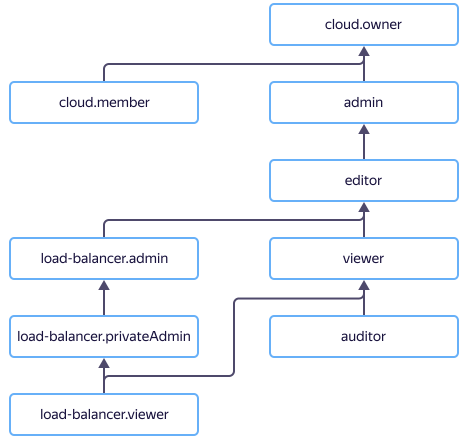

# Access management in {{ network-load-balancer-name }}

In this section, you will learn:
* [Which resources you can assign a role for](#resources).
* [Which roles exist in the service](#roles-list).
* [Which roles are required](#choosing-roles) for particular actions.





## Which resources you can assign a role for {#resources}



## Which roles exist in the service {#roles-list}



### Service roles {#service-roles}

#### load-balancer.auditor {#load-balancer-auditor}



#### load-balancer.viewer {#load-balancer-viewer}



#### load-balancer.privateAdmin {#load-balancer-private-admin}



#### load-balancer.editor {#load-balancer-editor}



#### load-balancer.admin {#load-balancer-admin}



### Primitive roles {#primitive-roles}





## What roles do I need {#choosing-roles}

The table below lists the roles required to perform a particular action. You can always assign a role offering more permissions than the one specified. For example, you can assign the `editor` role instead of `viewer`.

Any operations with a network load balancer that has a public IP address require the `load-balancer.admin` role. In networks hosting target groups, you can use the `vpc.publicAdmin` role instead. Operations on the internal network load balancer require the `load-balancer.privateAdmin` role and operations on its target groups, the `load-balancer.privateAdmin` or `compute.admin` role.

Operations on target groups located in subnets which do not have the specified administrative roles require the `vpc.user` role for those subnets.

Action | Methods | Required roles
----- | ----- | -----
**Viewing data** | |
Viewing information about any resource | `get`, `list`, `listOperations` | `viewer` for the resource
**Manage network load balancers** | |
[Create](../operations/load-balancer-create.md) and update load balancers in folders | `create` | `load-balancer.privateAdmin` / `load-balancer.admin` or `editor` for the folder and networks hosting the target groups (if the load balancer is public)
[Delete load balancers](../operations/load-balancer-delete.md) | `update`, `delete` | `load-balancer.privateAdmin` / `load-balancer.admin` or `editor` for the load balancer
[Attach target groups](../operations/target-group-attach.md) | `attachTargetGroup`| `load-balancer.privateAdmin` / `load-balancer.admin` or `editor` for the folder and networks hosting the target groups (if the load balancer is public)
[Detach target groups](../operations/target-group-detach.md) | `detachTargetGroup` | `load-balancer.privateAdmin` / `load-balancer.admin` or `editor` for the load balancer
[Get the status of target groups](../operations/check-resource-health.md) | `getTargetStates` | `load-balancer.viewer` or `viewer` for the load balancer and specified target groups
[Add](../operations/listener-add.md) and [remove](../operations/listener-remove.md) listeners | `addListener`, `removeListener` | `load-balancer.privateAdmin` / `load-balancer.admin` or `editor` for the load balancer
[Stop and start](../operations/load-balancer-start-and-stop.md) a load balancer | `stop`, `start` | `load-balancer.privateAdmin` / `load-balancer.admin` or `editor` for the load balancer
**Manage target groups** | |
[Create](../operations/target-group-create.md) and update target groups in folders | `create` | `load-balancer.privateAdmin` / `load-balancer.admin` or `editor` for the folder and subnets where target groups are located
[Delete target groups](../operations/target-group-delete.md) | `update`, `delete` | `load-balancer.privateAdmin` / `load-balancer.admin` or `editor` for the target group and load balancer
Add resources in a target group | `addTargets` | `load-balancer.privateAdmin` / `load-balancer.admin` or `editor` for the target group, load balancer, and subnets where target groups are located
Remove resources in a target group | `removeTargets` | `load-balancer.privateAdmin` / `load-balancer.admin` or `editor` for the target group
**Resource access management** | |
[Granting a role](../../iam/operations/roles/grant.md), [revoking a role](../../iam/operations/roles/revoke.md), and viewing roles granted for the resource | `setAccessBindings`, `updateAccessBindings`, `listAccessBindings` | `admin` for the resource

#### What's next {what-is-next}

* [How to assign a role](../../iam/operations/roles/grant.md).
* [How to revoke a role](../../iam/operations/roles/revoke.md).
* [Learn more about access management in {{ yandex-cloud }}](../../iam/concepts/access-control/index.md).
* [Learn more about inheriting roles](../../resource-manager/concepts/resources-hierarchy.md#access-rights-inheritance).
