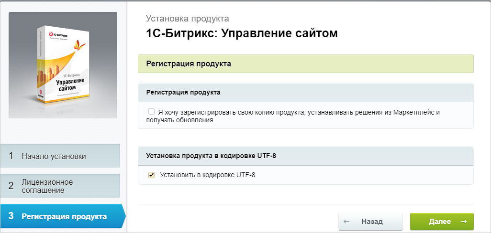

Установите и настройте «1С-Битрикс»:
1. Откройте веб-интерфейс «1С-Битрикс: Управление сайтом». Для этого в браузере перейдите по адресу `http://<публичный_IP-адрес_ВМ>/`. Должна открыться страница с приглашением установить «1С-Битрикс».
1. Нажмите кнопку **Далее**.

   

1. Ознакомьтесь с лицензионным соглашением и выберите **Я принимаю лицензионное соглашение**. Затем нажмите кнопку **Далее**.

   

1. Регистрация необязательна, поэтому уберите соответствующую галочку, но оставьте **Установить в кодировке UTF-8** и нажмите кнопку **Далее**.

   

1. Система проверит, верно ли сконфигурирован сервер. Просмотрите все параметры на данной странице и нажмите кнопку **Далее**.

   

1. Настройте БД:
   1. В поле **Сервер** укажите полное доменное имя созданной вами БД. Чтобы его узнать:
      1. В [консоли управления]({{ link-console-main }}) перейдите в новой вкладке браузера на страницу каталога.
      1. В списке сервисов выберите **{{ ui-key.yacloud.iam.folder.dashboard.label_managed-mysql }}**.
      1. В открывшемся окне выберите созданный ранее кластер `BitrixMySQL`.
      1. В меню слева выберите вкладку **{{ ui-key.yacloud.mysql.cluster.switch_hosts }}**.
      1. В поле **{{ ui-key.yacloud.mdb.cluster.hosts.host_column_name }}** подведите курсор к имени хоста (вида `rc1c-cfazv1db********`) и скопируйте полное доменное имя базы данных, нажав появившийся значок . К имени хоста добавится полное доменное имя, в результате в поле **Сервер** должно быть указано имя вида `rc1c-cfazv1db********.{{ dns-zone }}`.
   1. В полях **Имя пользователя** и **Пароль** укажите данные, с которыми вы создавали БД в разделе [Создайте кластер БД {{ MY }}](#create-mysql).
   1. В поле **Имя базы данных** укажите имя созданной БД (`db1`).
   1. Нажмите кнопку **Далее**.

   

1. Дождитесь инициализации БД {{ MY }}.

   

1. Создайте аккаунт администратора, который сможет вносить изменения в вашу систему. Заполните все поля и нажмите кнопку **Далее**.

   

1. Выберите шаблон **Информационный портал** и нажмите кнопку **Далее**.

   

1. Подтвердите выбор единственного шаблона оформления, нажав кнопку **Далее**.

   

1. Выберите цветовое оформление и нажмите кнопку **Далее**.

   

1. Заполните все поля в соответствии с требованиями к сайту и нажмите кнопку **Установить**. Начнется установка и настройка всех компонентов системы. Дождитесь ее окончания.

   

1. Через некоторое время появится страница, уведомляющая о том, что система установлена и настроена. Для начала работы с сайтом нажмите кнопку **Перейти на сайт**.

   

1. Вы открыли веб-интерфейс полностью готовой для дальнейшей эксплуатации системы в режиме редактирования содержимого.

   

1. Чтобы увидеть главную страницу сайта глазами пользователя, выйдите из режима администрирования вашим сайтом. Для этого в правом верхнем углу страницы нажмите **Выйти**, затем перейдите по адресу `http://<публичный_IP-адрес_ВМ>/`.
   Чтобы вернуться в режим редактирования, авторизуйтесь на сайте с учетными данными администратора, которые вы указали при настройке «1С-Битрикс».

   