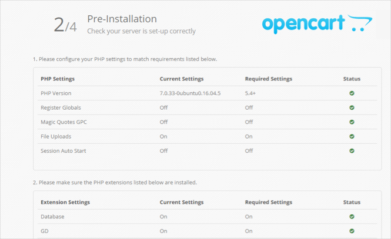
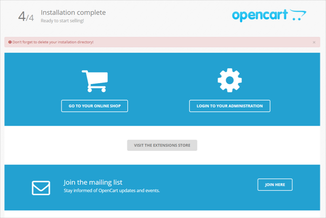

1. Откройте веб-интерфейс интернет-магазина OpenCart. Для этого откройте в браузере адрес `http://<публичный_IP-адрес_ВМ>/`. Откроется страница настройки OpenCart.
1. Ознакомьтесь с лицензией и нажмите **Continue**.

   

1. Убедитесь, что все строки с требованиями к системе отмечены зелеными галочками, и нажмите кнопку **Continue**.

   

1. Настройте доступ к БД:

   

   - Локальный сервер {{ MY }}

     Атрибуты подключения к БД генерируются в специальном файле при создании ВМ:
     1. Зайдите по SSH на созданную ВМ.
     1. Перейдите в режим администратора `sudo -i`.
     1. Откройте файл `default_passwords.txt` в домашней директории администратора:

        ```bash
        root@opencart:~# cat default_passwords.txt
        MYSQL_USER=opencart
        MYSQL_PASS=qDbvN1R6tA6ET
        MYSQL_ROOT_PASS=5DiVb80l1kXVz
        MYSQL_DB=opencart
        ```

     1. На странице настройки OpenCart в секции БД, введите соответствующие данные:
        * **Username** — значение переменной `MYSQL_USER`.
        * **Database** — значение переменной `MYSQL_DB`.
        * **Password** — значение переменной `MYSQL_PASS`.

        Остальные поля оставьте без изменения.

   - Кластер {{ mmy-name }}

     Если вы используете кластер {{ mmy-name }}, введите нужные атрибуты кластера:
     * **Hostname** — укажите [полное доменное имя (FQDN)](../../compute/concepts/network.md#hostname) созданной БД. Чтобы его узнать:
       1. Перейдите в новой вкладке браузера на страницу каталога в [консоли управления]({{ link-console-main }}).
       1. Выберите раздел **{{ mmy-name }}**.
       1. В таблице выберите созданный вами кластер.
       1. В меню слева выберите вкладку **Хосты**.
       1. Подведите курсор к полю **Имя хоста** (например, `rc1c-vok617m35g3dj23i`) и скопируйте полное доменное имя БД, нажав на значок .
     * **Username** — имя пользователя (в примере `user1`).
     * **Database** — имя БД (в примере `db1`).
     * **Password** — указанный вами пароль пользователя.

     Остальные поля оставьте без изменения.

   

1. Задайте имя администратора, его пароль и актуальный электронный адрес. После этого нажмите кнопку **Continue**.

   

1. Откроется страница с уведомлением о том, что система настроена. Чтобы настроить интернет-магазин, нажмите кнопку **Login to your administration** и введите логин и пароль администратора.

   

1. После завершения установки зайдите на ВМ по SSH и удалите ненужные установочные файлы:

   ```bash
   user@opencart:~$ sudo -i
   root@opencart:~# rm -rf /var/www/opencart/install/
   ```

1. Чтобы проверить главную страницу сайта, перейдите по адресу `http://<публичный_IP-адрес_ВМ>/`. Вы увидите главную страницу сайта глазами пользователя, посетившего ваш интернет-магазин.

   