# Анализ продаж и локаций пиццерий на данных из БД {{ CH }} и {{ marketplace-short-name }}



В этом руководстве вы подготовите дашборд по выбору помещений для открытия новых пиццерий Додо.

С помощью {{ datalens-short-name }} вы проанализируете локации на основе реальных данных:

* Выручка по текущим пиццериям Додо.
* Поисковые запросы к пиццериям по локациям (данные Яндекса).
* Численность всех пиццерий по локациям (данные Яндекса).

В качестве источника используется демонстрационная база данных {{ CH }} и продукт **Организации: спрос и предложение** из {{ marketplace-short-name }}.

Руководство также доступно в [записи](https://www.youtube.com/watch?v=cw6PotbQYng) на YouTube-канале {{ yandex-cloud }}.

Для визуализации и исследования данных [подготовьте {{ datalens-short-name }} к работе](#before-you-begin), затем выполните следующие шаги:

1. [Создайте воркбук](#create-workbook).
1. [Импортируйте геослои из {{ marketplace-short-name }}](#import-from-marketplace).
1. [Изучите дашборд](#view-dashboard).
1. [Создайте подключение](#create-connection).
1. [Создайте датасет](#create-dataset).
1. [Проанализируйте динамику открытия пиццерий](#create-column-chart).
1. [Исследуйте выручку пиццерий](#create-bar-chart).
1. [Посчитайте сумму выручки и количество пиццерий](#create-indicator-chart).
1. [Исследуйте плотность заказов на карте](#create-map-chart).
1. [Создайте дашборд](#create-dashboard).
1. [Добавьте геослои на дашборд](#add-geolayers).

## Перед началом работы {#before-you-begin}



## Создайте воркбук {#create-workbook}

1. Перейдите на [главную страницу]({{ link-datalens-main }}) {{ datalens-short-name }}.
1. На панели слева выберите  **Коллекции и воркбуки**.
1. В правом верхнем углу нажмите **Создать** → **Создать воркбук**.
1. Введите название [воркбука](../../datalens/workbooks-collections/index.md) — `Организации: спрос и предложение`.
1. Нажмите кнопку **Создать**.

## Импортируйте геослои из {{ marketplace-short-name }} {#import-from-marketplace}

1. Перейдите в [{{ marketplace-short-name }}]({{ link-datalens-main }}/marketplace) {{ datalens-short-name }}.
1. Выберите категорию **Геослои**, затем товар **Организации: спрос и предложение**.
1. Нажмите **Развернуть** в открывшейся карточке товара.
1. Выберите воркбук `Организации: спрос и предложение`.
1. Нажмите кнопку **Развернуть**.

   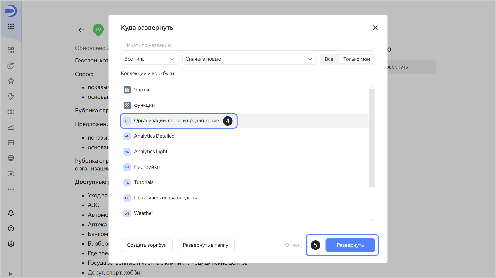

## Изучите дашборд {#view-dashboard}

1. Откройте дашборд `Организации: спрос и предложение`.
1. Изучите дашборд:

   * В верхней части находятся фильтры по городу, рубрике и типу полигона.
   * В таблицах можно посмотреть информацию о спросе и предложении:

     * `Спрос` — число поисковых запросов пользователей геосервисов Яндекса к выбранной категории организаций или услуг. Категория (рубрика) определяется из запроса. Учитываются локальные запросы с мобильных устройств с радиусом поиска менее 3 км.
     * `Предложение` — число существующих организаций выбранной категории. Используются данные организаций из [Яндекс Справочника](https://business.yandex.ru/sprav/).
     * `Спрос на предложение` — показывает, насколько предложение покрывает спрос в полигоне относительно всего города.

   * На карте отображается распределение спроса и предложения по городу.

1. Выберите рубрику `Пиццерия` и ознакомьтесь на карте с показателями `Спрос`, `Предложение` и `Спрос на предложение на город`.

   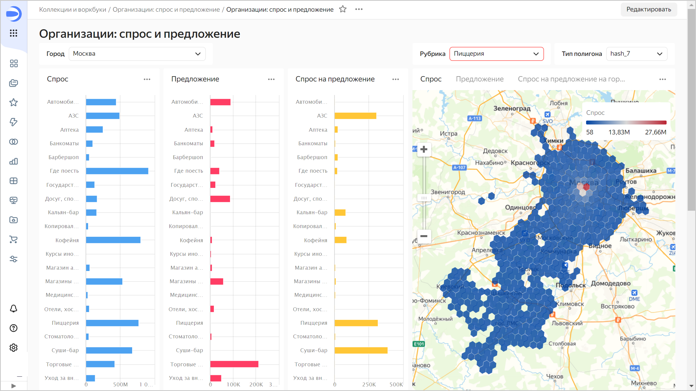

## Создайте подключение {#create-connection}

1. Перейдите в воркбук `Организации: спрос и предложение` — нажмите его название в пути до дашборда.

   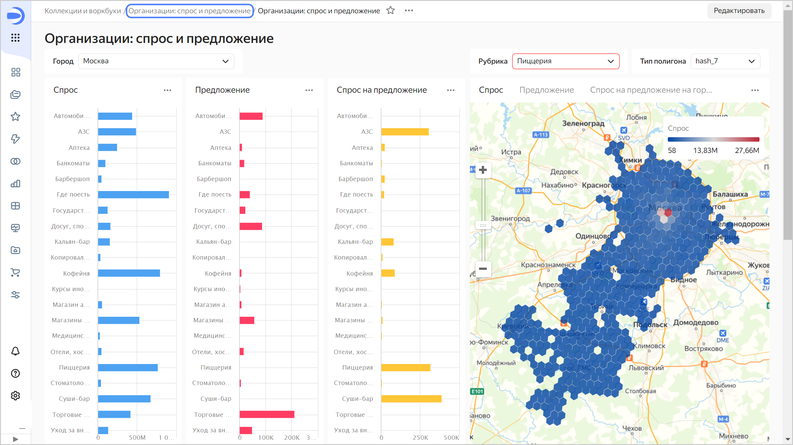

1. В правом верхнем углу нажмите **Создать** →  **Подключение**.
1. В разделе **Базы данных** выберите подключение **{{ CH }}**.

   1. В открывшемся окне выберите тип подключения `Указать вручную` и укажите параметры подключения:

      * **Имя хоста** — `rc1a-g1gicp3imcc0pnsg.{{ dns-zone }},rc1b-vbbl6tob599tr3oi.{{ dns-zone }},rc1d-qf1ven1igeihhbep.{{ dns-zone }}` (указать через запятую).
      * **Порт HTTP-интерфейса** — `8443` (по умолчанию).
      * **Имя пользователя** — `datalens-marathon-2020-11-ro`.
      * **Пароль** — `/4b+xBF6aSCgN9wKTevYGuDjxC9IO4Fa`.

   1. Нажмите кнопку **Проверить подключение** и убедитесь, что появился зеленый значок.
   1. Нажмите кнопку **Создать подключение**.
   1. Введите название подключения — `DODO Con`.
   1. Нажмите кнопку **Создать**.

      

Дождитесь сохранения подключения.

## Создайте датасет {#create-dataset}

Создайте [датасет](../../datalens/dataset/index.md) на базе подключения `DODO Con`:

1. На странице подключения в правом верхнем углу нажмите кнопку **Создать датасет**.
1. Перенесите на рабочую область таблицу `marathon-2020-11.DODO_opendata`.

   

1. Перейдите на вкладку **Поля**.
1. Переименуйте поле `Name` в `Pizzerias`. Чтобы изменить название поля, нажмите на его имя, удалите текущее имя и введите новое.
1. Для поля `Coordinates` в столбце **Тип** выберите **Геоточка**.
1. Для поля `Revenue` укажите тип агрегации **Сумма**. Поля с определенными функциями агрегации становятся показателями и меняют свой цвет на синий.

   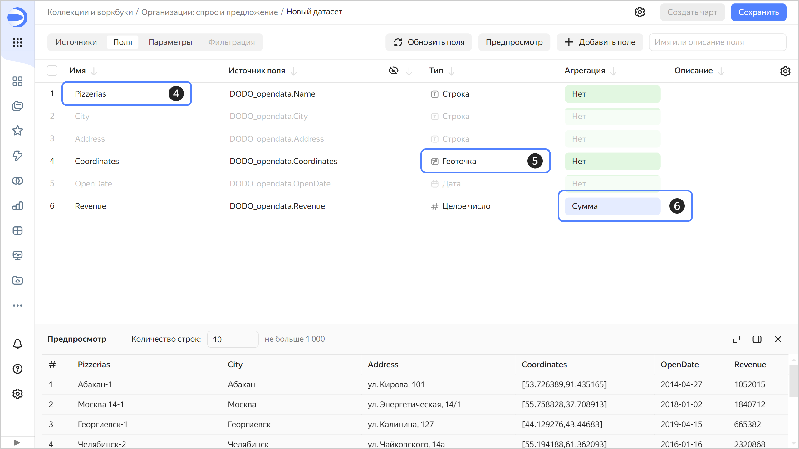

1. Создайте показатель с количеством пиццерий:

   1. Продублируйте поле `Pizzerias` — в правой части строки с полем нажмите  и выберите **Дублировать**.
   1. Переименуйте дубликат поля `Pizzerias (1)` в `The number of pizzerias`.
   1. Измените тип агрегации на **Количество уникальных**.

      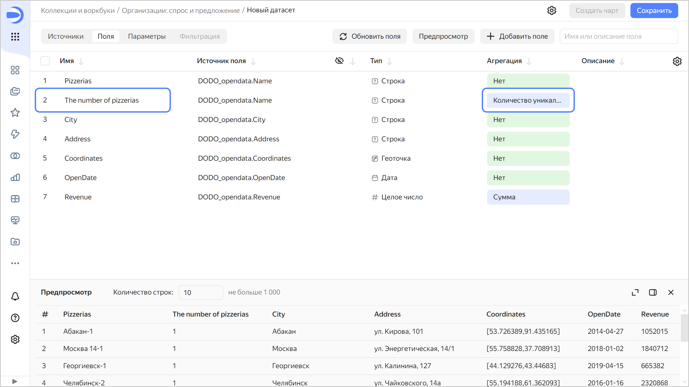

1. Создайте вычисляемое поле для ранжирования пиццерий по выручке:

   1. В правом верхнем углу нажмите кнопку **Добавить поле**.
   1. Слева вверху укажите название поля — `Rank по выручке`.
   1. В поле для формулы введите: `RANK([Revenue])`.
   1. Нажмите кнопку **Создать**.

      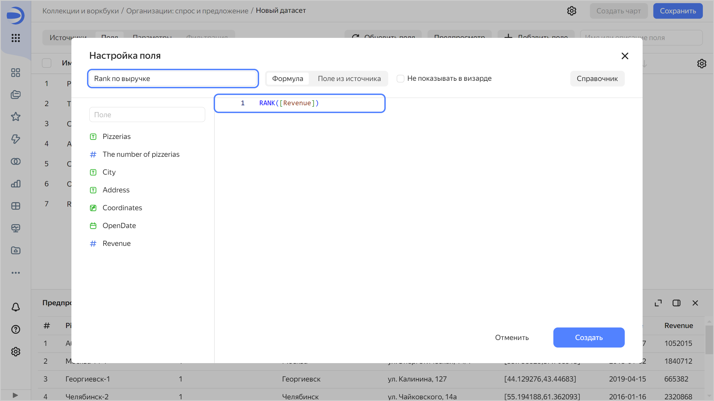

1. Сохраните датасет:

   1. В правом верхнем углу нажмите кнопку **Сохранить**.
   1. Введите название датасета — `DODO` и нажмите кнопку **Создать**.

## Проанализируйте динамику открытия пиццерий {#create-column-chart}

Для визуализации динамики открытия пиццерий по месяцам создайте [столбчатую диаграмму](../../datalens/visualization-ref/column-chart.md):

1. На странице датасета в правом верхнем углу нажмите кнопку **Создать чарт**.
1. Добавьте в чарт дату открытия. Для этого из раздела **Измерения** перетащите поле `OpenDate` в секцию **X**.
1. Добавьте в чарт показатель — число пиццерий. Для этого из раздела **Показатели** перетащите поле `The number of pizzerias` в секцию **Y**.

   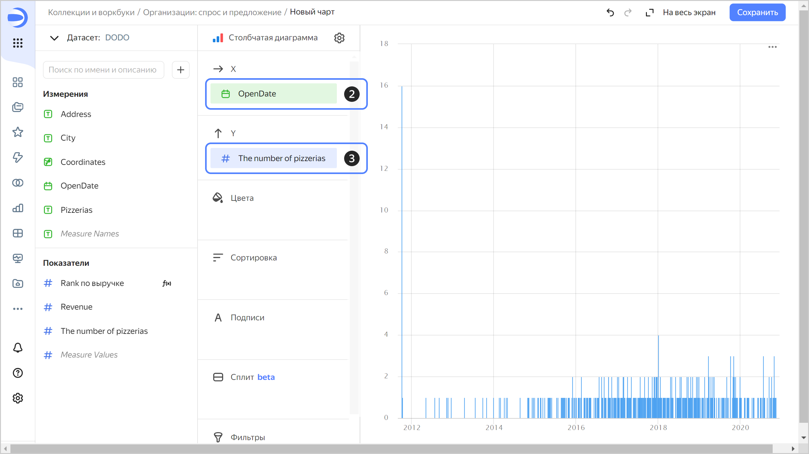

   Диаграмма покажет, сколько открылось новых пиццерий по дням.

1. Отобразите чарт по месяцам:

   1. Нажмите на иконку с календарем у поля `OpenDate` в секции **X**.
   1. В поле **Группировка** выберите **Округление** ⟶ **Месяц**, затем нажмите **Применить**.

      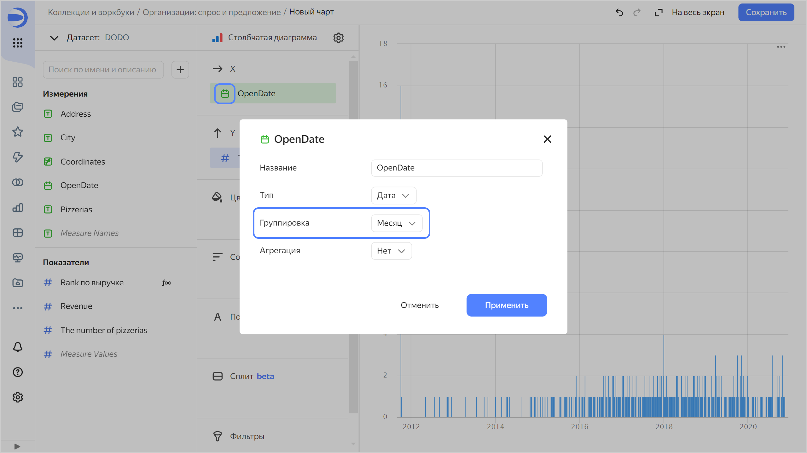

1. Сохраните чарт:

   1. В правом верхнем углу нажмите кнопку **Сохранить**.
   1. В открывшемся окне введите название чарта `Динамика открытий` и нажмите кнопку **Сохранить**.

      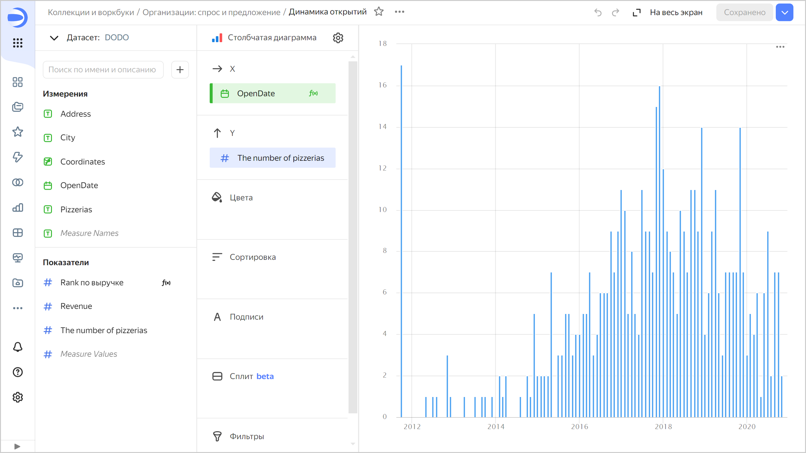

## Исследуйте выручку пиццерий {#create-bar-chart}

Чтобы отобразить рейтинг топ-10 пиццерий по выручке, создайте [линейчатую диаграмму](../../datalens/visualization-ref/bar-chart.md):

1. Создайте копию чарта, созданного на предыдущем шаге:

   1. В правом верхнем углу нажмите значок  → **Сохранить как копию**.

      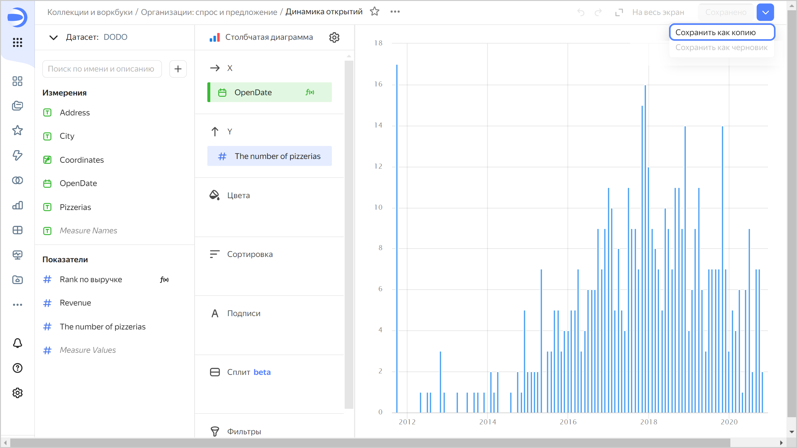

   1. В открывшемся окне введите название нового чарта `Топ-10 пиццерий` и нажмите кнопку **Сохранить**.

1. Выберите тип визуализации **Линейчатая диаграмма**.

   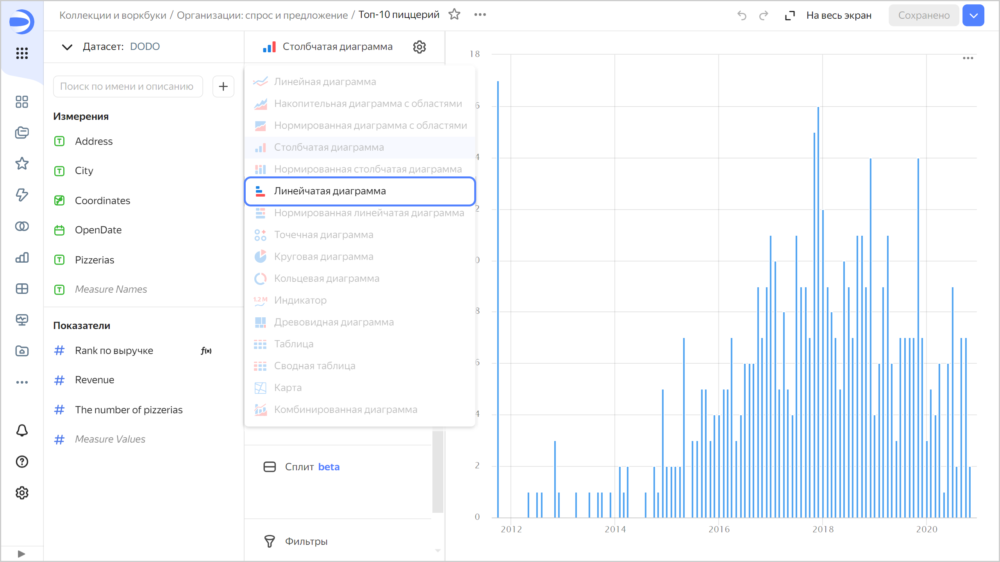

1. Замените месяцы на названия пиццерий на оси Y. Для этого из раздела **Измерения** перетащите поле `Pizzerias` в секцию **Y** и наведите его над полем `OpenDate`, пока то не станет красным.
1. Замените количество пиццерий на сумму выручки на оси X. Для этого из раздела **Показатели** перетащите поле `Revenue` в секцию **X** и наведите его над полем `The number of pizzerias`, пока то не станет красным.
1. Отсортируйте диаграмму по убыванию выручки. Для этого из раздела **Показатели** перетащите поле `Revenue` в секцию **Сортировка**. На диаграмме отобразилась сумма выручки по пиццериям.
1. Добавьте фильтрацию для топ-10 пиццерий по выручке:

   1. Из раздела **Показатели** перетащите поле `Rank по выручке` в секцию **Фильтры**.
   1. Из списка **Операция** выберите `Меньше или равно`.
   1. В поле **Значение** укажите число `10`.

      

   1. Нажмите кнопку **Применить фильтр**.

   На диаграмме отобразится рейтинг топ-10 пиццерий по России.

   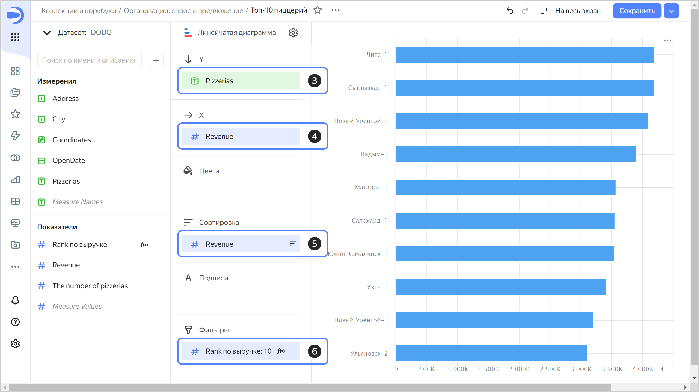

1. В правом верхнем углу нажмите кнопку **Сохранить**.

## Посчитайте сумму выручки и количество пиццерий {#create-indicator-chart}

Чтобы отобразить сумму выручки, создайте [индикатор](../../datalens/visualization-ref/indicator-chart.md):

1. Создайте копию чарта, созданного на предыдущем шаге:

   1. В правом верхнем углу нажмите значок  → **Сохранить как копию**.
   1. В открывшемся окне введите название нового чарта `Выручка` и нажмите кнопку **Сохранить**.

1. Выберите тип визуализации **Индикатор**.

   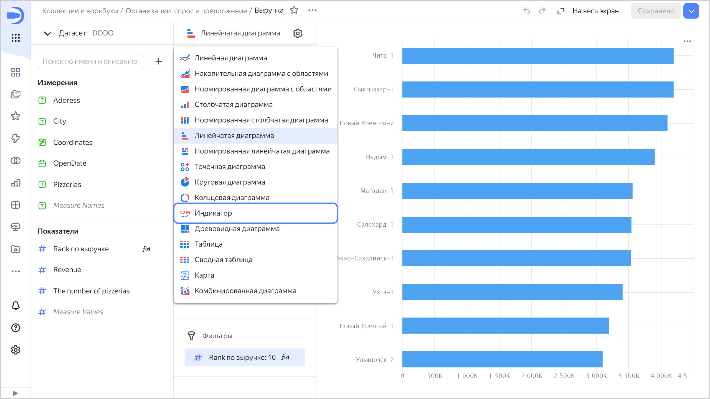

1. Уберите фильтрацию топ-10 пиццерий по выручке — в секции **Фильтры** напротив поля `Rank по выручке` нажмите значок  (значок появляется при наведении указателя на поле).
1. Из раздела **Показатели** перетащите поле `Revenue` в секцию **Показатель**.
1. Уберите отображение заголовка в настройках чарта:

   1. Справа от типа визуализации нажмите значок .
   1. Выберите для заголовка значение **Скрыть**.
   1. Нажмите кнопку **Применить**.

      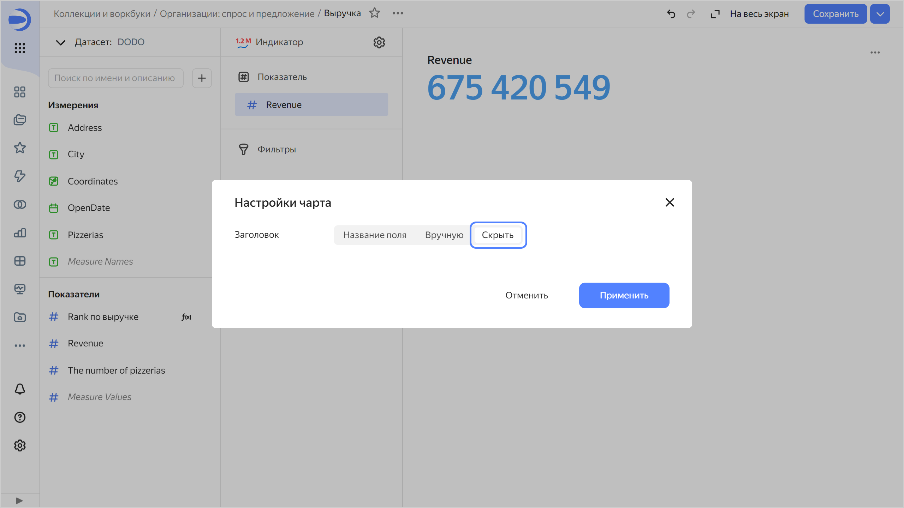

1. В правом верхнем углу нажмите кнопку **Сохранить**.

   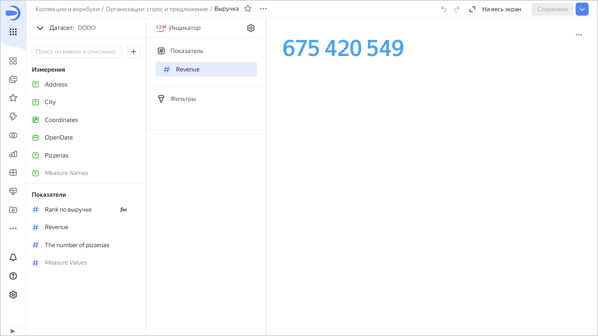

Чтобы отобразить количество пиццерий, создайте еще один индикатор:

1. Создайте копию чарта, созданного на предыдущем шаге:

   1. В правом верхнем углу нажмите значок  → **Сохранить как копию**.
   1. В открывшемся окне введите название нового чарта `Количество пиццерий` и нажмите кнопку **Сохранить**.

1. Замените выручку на количество пиццерий. Для этого из раздела **Показатели** перетащите поле `The number of pizzerias` в секцию **Показатель** и наведите его над полем `Revenue`, пока то не станет красным.
1. В правом верхнем углу нажмите кнопку **Сохранить**.

   

## Исследуйте плотность заказов на карте {#create-map-chart}

Для визуализации плотности заказов на карте России создайте [карту](../../datalens/visualization-ref/point-map-chart.md).

1. Создайте копию чарта, созданного на предыдущем шаге:

   1. В правом верхнем углу нажмите значок  → **Сохранить как копию**.
   1. В открывшемся окне введите название нового чарта `Пиццерии на карте` и нажмите кнопку **Сохранить**.

1. Выберите тип визуализации **Карта**.

   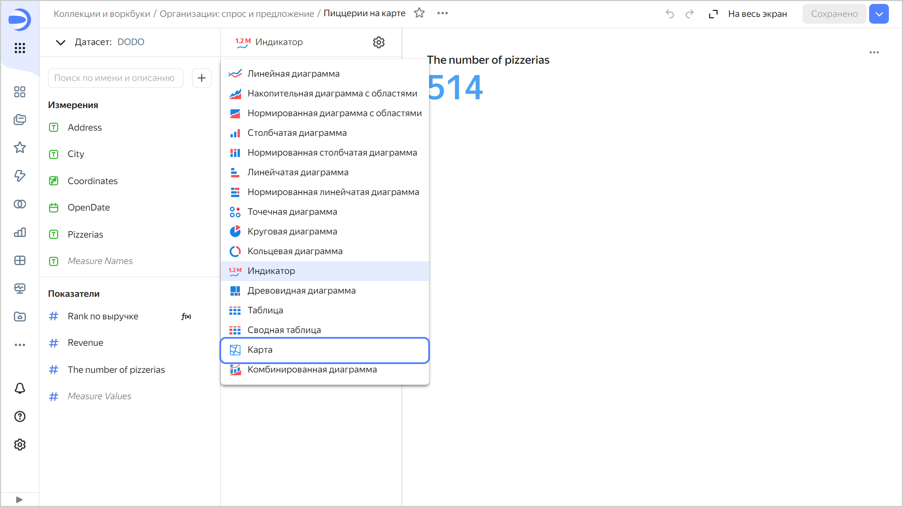

1. Добавьте на карту координаты пиццерий. Для этого из раздела **Измерения** перетащите поле `Coordinates` в секцию **Точки (Геоточки)**.
1. Измените размер точек относительно показателя выручки. Для этого из раздела **Показатели** перетащите поле `Revenue` в секцию **Размер**.
1. Измените цвет точек относительно показателя выручки. Для этого из раздела **Показатели** перетащите поле `Revenue` в секцию **Цвета**.
1. Добавьте в секцию **Тултипы** поля:

   * `Pizzerias`;
   * `Address`;
   * `OpenDate`;
   * `Revenue`.

     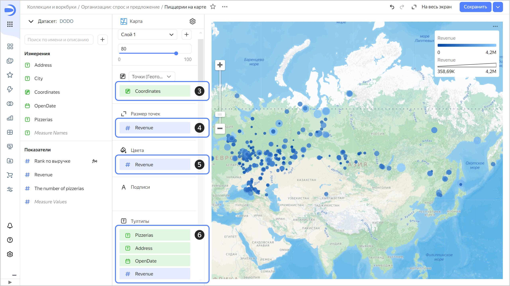

1. Измените настройки секции **Цвета**:

    1. В секции **Цвета** нажмите значок  (значок появляется при наведении указателя на секцию).
    1. Выберите тип градиента **Двухцветный** и цвет **Желтый (оттенки)**.
    1. Нажмите кнопку **Применить**.

       

1. В правом верхнем углу нажмите кнопку **Сохранить**.

    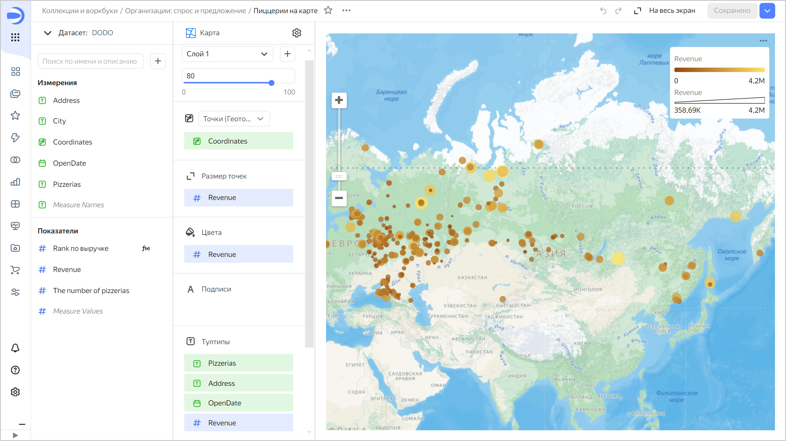

## Создайте дашборд {#create-dashboard}

1. Перейдите в воркбук `Организации: спрос и предложение` — нажмите его название в пути до дашборда.
1. В правом верхнем углу нажмите **Создать** →  **Дашборд**.
1. На панели в нижней части страницы выберите виджет **Чарт**.

   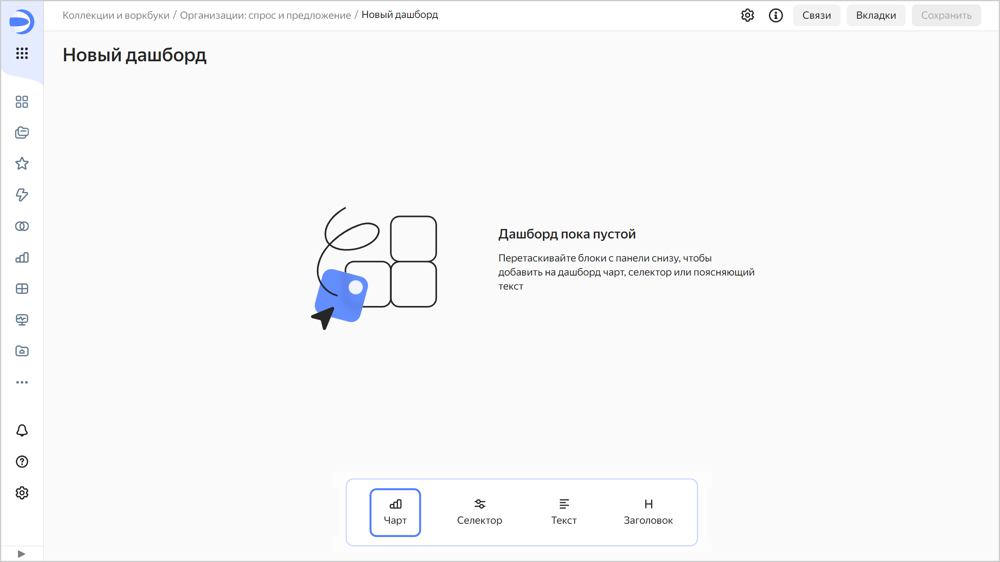

1. В открывшемся окне нажмите кнопку **Выбрать**.
1. Выберите чарт `Динамика открытий`. После этого автоматически заполнится поле **Название**.
1. Нажмите кнопку **Добавить**.

   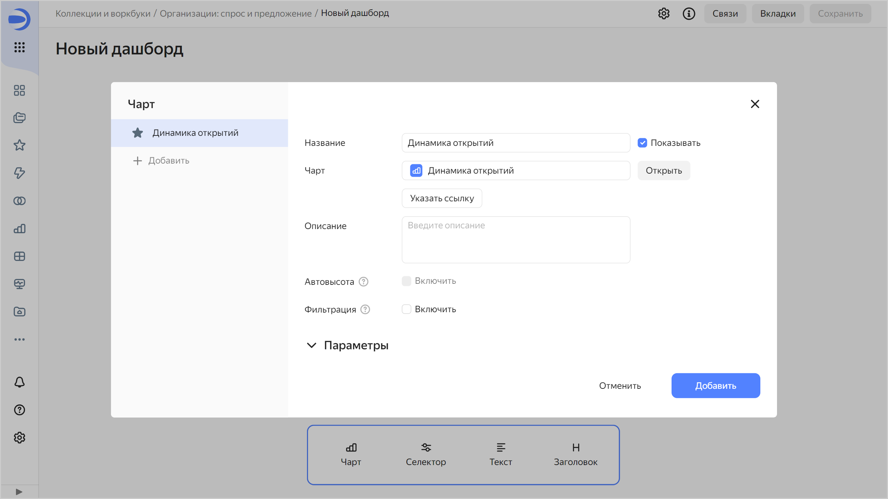

1. Повторите шаги 3-6, чтобы добавить чарты:

   * `Топ-10 пиццерий`;
   * `Выручка`;
   * `Количество пиццерий`;
   * `Пиццерии на карте`.

1. Установите размеры чартов с помощью мыши и расположите их на дашборде в удобном для вас порядке.

   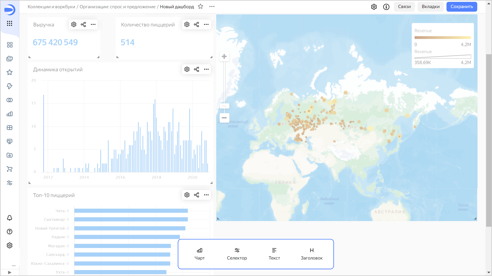

Добавьте [селектор](../../datalens/dashboard/selector.md), чтобы фильтровать чарты по городу:

1. На панели в нижней части страницы выберите виджет **Селектор**.

   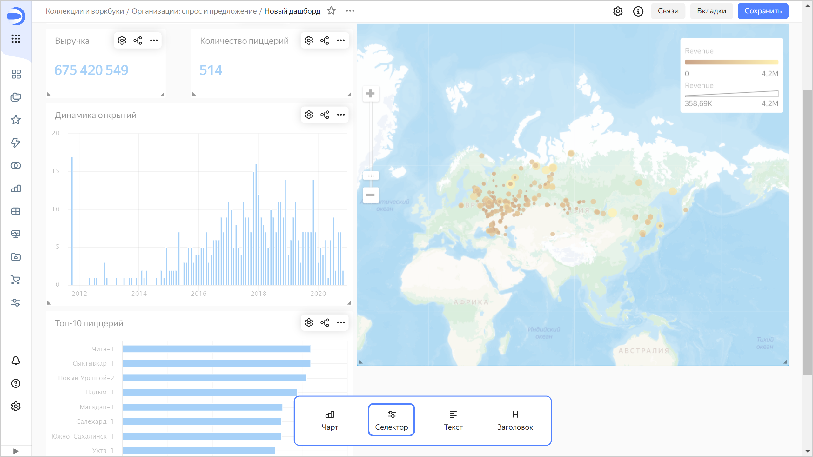

1. Добавьте селектор с календарем по датам заказа:

   1. Выберите датасет `DODO`.
   1. Выберите поле `City`.
   1. Укажите заголовок: `Город`.
   1. Нажмите кнопку **Сохранить**.

      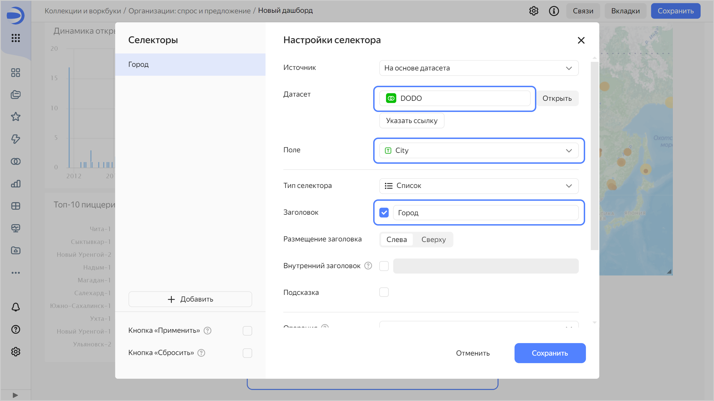

1. Перетащите селектор вверх дашборда.
1. Сохраните дашборд:

   1. В правом верхнем углу дашборда нажмите кнопку **Сохранить**.
   1. Введите название дашборда `DODO Dashboard` и нажмите кнопку **Создать**.

Дашборд готов.

Выберите в селекторе город `Москва`. Если фокус карты остался на прежней локации, обновите страницу браузера. {{ datalens-name }} фиксирует масштаб и местоположение карты, если вы изменяли их в рамках текущей сессии.

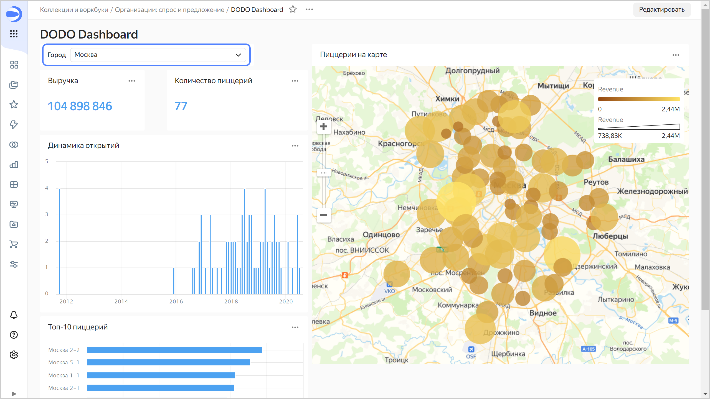

## Добавьте геослои на дашборд {#add-geolayers}

1. Убедитесь, что на дашборде в фильтре города выбрана только Москва. В правом верхнем углу карты нажмите значок  →  **Редактировать**.

   

1. Нажмите на название датасета **DODO**.
1. Нажмите кнопку  **Добавить датасет**.
1. Выберите датасет `Организации`, [импортированный из {{ marketplace-short-name }}](#import-from-marketplace).

   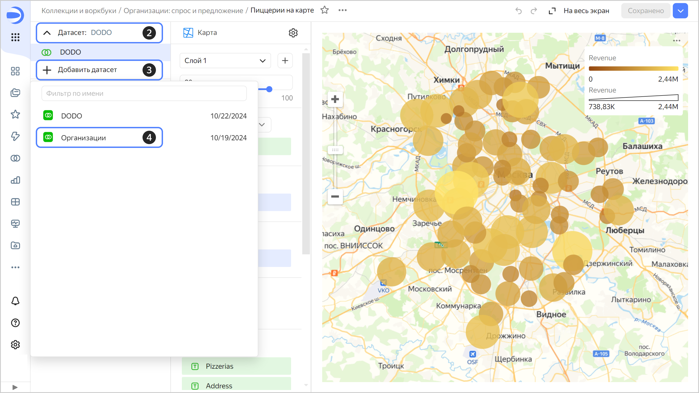

1. После выбора датасета появится окно настройки связей. По умолчанию связь устанавливается по полям с одинаковыми названиями.

   1. Нажмите кнопку **Добавить связь**.
   1. Установите связь между полями датасетов `City` (DODO) и `Город` (Организации) и нажмите **Сохранить**.
  
      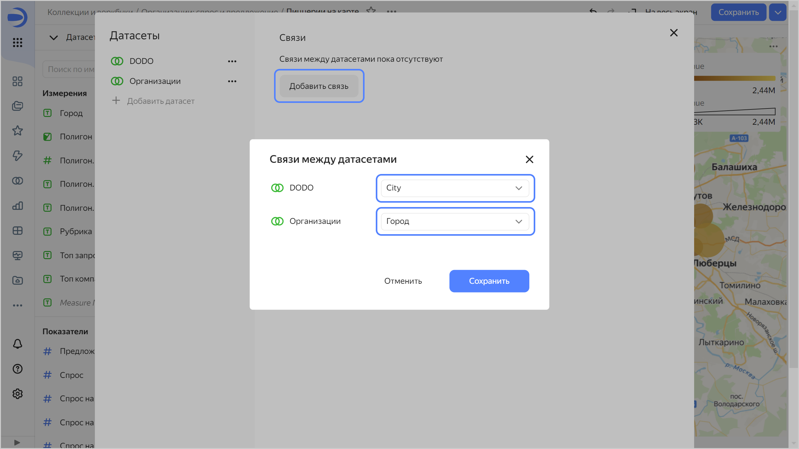

1. Закройте окно **Cвязи**, нажав кнопку **Сохранить**.

1. Переименуйте слой **Слой 1**:

   1. Нажмите на слой и справа от названия нажмите значок  (значок появляется при наведении указателя на слой).

      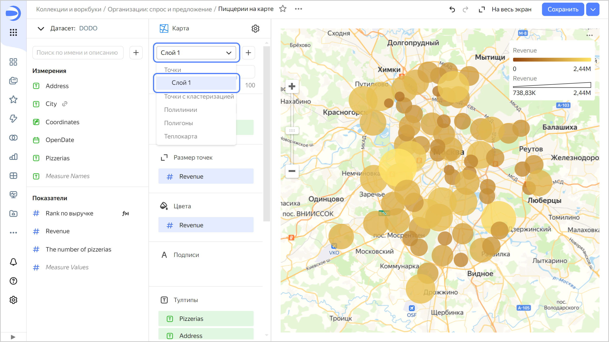

   1. В открывшемся окне **Настройки слоя** укажите название `ДОДО` и нажмите кнопку **Применить**.

1. Добавьте еще один слой:

   1. Нажмите кнопку  справа от слоя.
   1. Переименуйте слой в `Спрос на предложение`.
   1. Измените тип геослоя **Точки (Геоточки)** на **Полигоны (Геополигоны)**.

   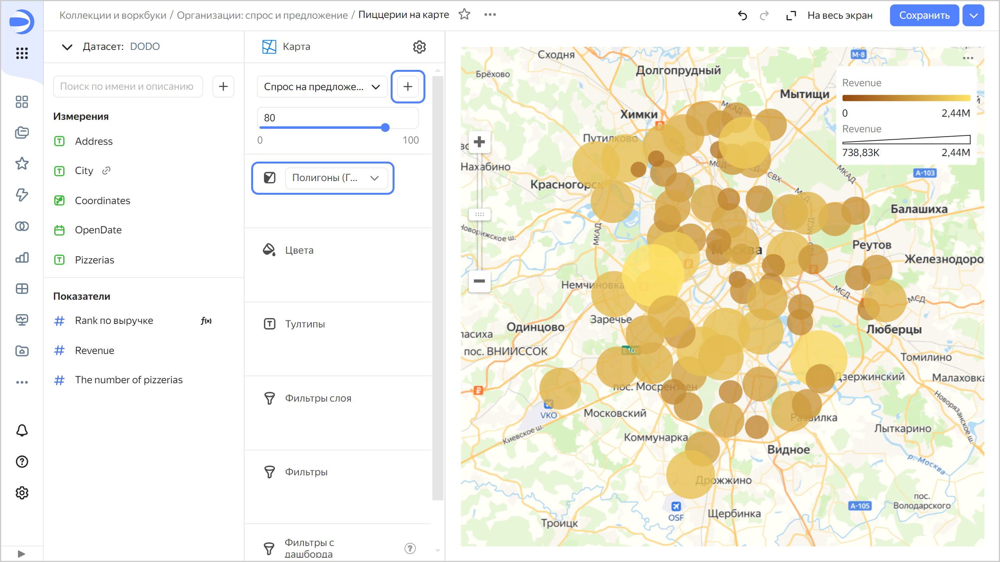

1. Убедитесь, что текущий датасет – `Организации`, а не `DODO`. Если текущий датасет `DODO`, то нажмите в левом верхнем углу на название датасета и выберите `Организации`.

   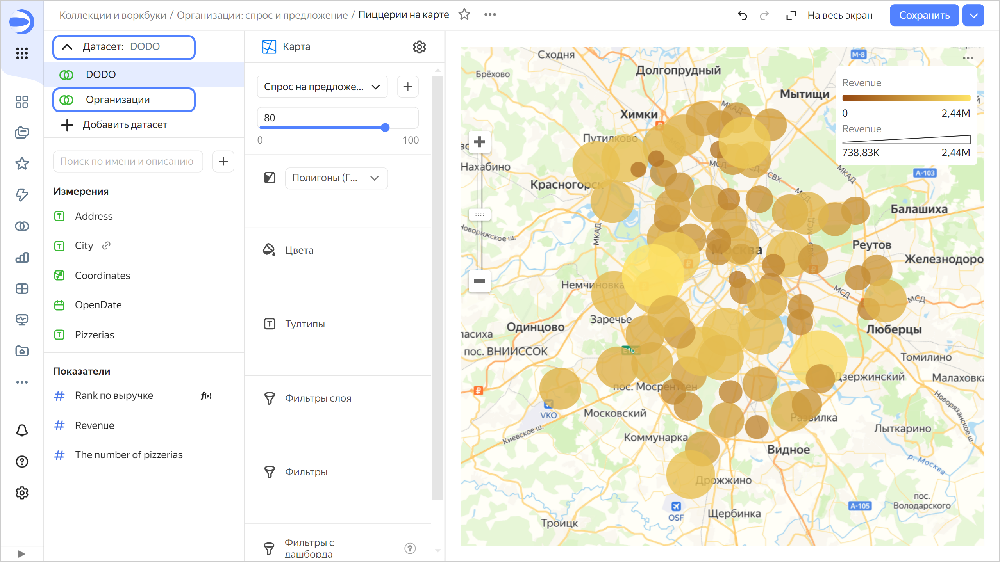

1. Перетащите измерение `Полигон` в секцию **Полигоны**.
1. Добавьте измерение `Полигон.Тип` в секцию **Фильтры** и выберите значение `hash7`. Нажмите кнопку **Применить фильтр**.
1. Добавьте измерение `Рубрика` в секцию **Фильтры слоя** и выберите значение `Пиццерия`. Нажмите кнопку **Применить фильтр**.
1. Добавьте показатель `Спрос на предложение на город` в секцию **Цвета**.
1. В настройках цвета выберите трехцветный градиент `Синий-Серый-Красный` и нажмите **Применить**.

    

1. Измените уровень прозрачности до `60`.

   

1. Добавьте в секцию **Тултипы** поля:

   * `Спрос`;
   * `Предложение`;
   * `Спрос на предложение на город`;
   * `Топ запросов`;
   * `Топ компаний`.

     

1. Сохраните чарт — в правом верхнем углу нажмите кнопку **Сохранить**.
1. Вернитесь на дашборд, открытый на предыдущей вкладке браузера, и обновите страницу.
1. Выберите в селекторе `Санкт-Петербург`. После этого дашборд, включая карту и внешний геослой, отфильтруется полностью по этому селектору.

   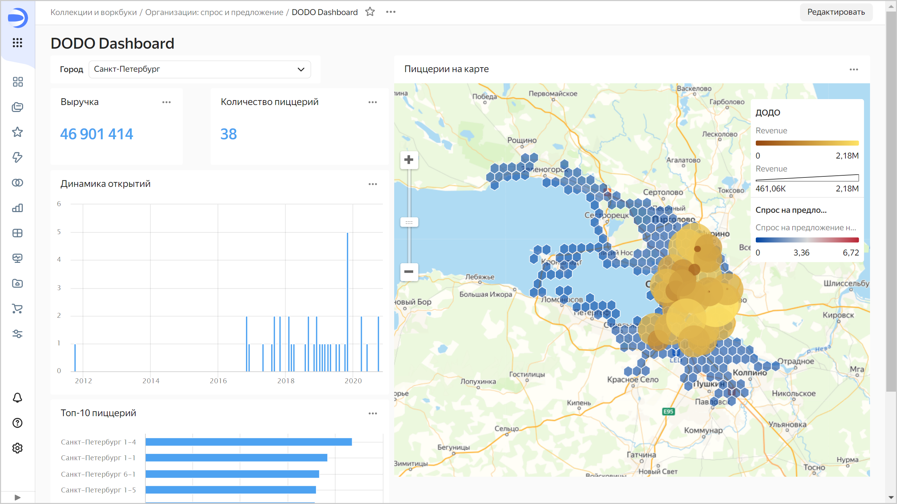

Если при изменении города в фильтре фокус карты остался на прежней локации, обновите страницу браузера. {{ datalens-name }} фиксирует масштаб и местоположение карты, если вы изменяли их в рамках текущей сессии.

## Дополнительно {#additional}

В качестве идей для дальнейшей самостоятельной работы предлагаем:

1. Добавить геослой с организациями категории `Где поесть` (в целом рестораны и фастфуд, не только пиццерии).
1. Добавить из {{ marketplace-short-name }} продукт [Аудитория: интересы и соцдем]({{ link-datalens-main }}/marketplace/f2eemc2dui59rn72h0ck), чтобы аналогично отобразить на карте данные по аудитории города.
1. На примере Воронежа можно изучить бесплатные [геослои от компании Геоинтеллект]({{ link-datalens-main }}/marketplace/f2eu3edujf1jdmaihu7u). Демонабор содержит посчитанные индексы бизнес-потенциала локации для фастфуда.
