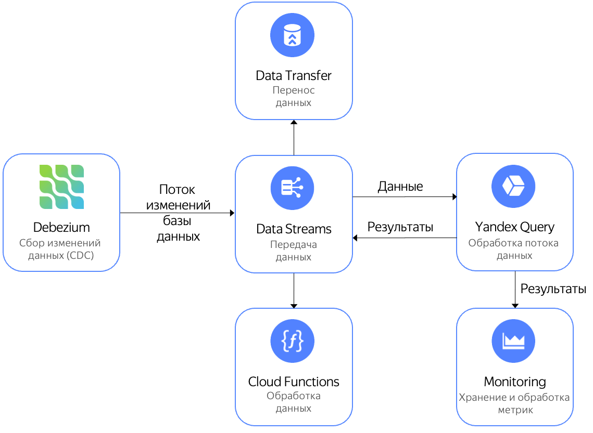

# Обработка потока изменений Debezium

[Debezium](https://debezium.io) — это сервис для захвата изменений в базах данных и отправки их на обработку в другие системы. С помощью {{ yds-full-name }} можно захватывать эти изменения, а с помощью {{ yq-full-name }} выполнять их обработку. Обработанные данные можно:

* отправить в {{ monitoring-full-name }} для построения графика и алертинга;
* записать в поток {{ yds-short-name }} и далее отправить на обработку в {{ sf-full-name }};
* записать в поток {{ yds-short-name }} и далее передать в {{ data-transfer-full-name }} [для отправки в различные системы хранения](../../data-streams/tutorials/data-ingestion.md).



В этом сценарии вы отправите изменения базы данных [{{ PG }}](https://www.postgresql.org/) в поток {{ yds-short-name }} с помощью Debezium, а затем выполните к ним запрос с помощью {{ yq-name }}. В результате выполнения запроса вы получите количество изменений в таблицах БД, сгруппированное по интервалам продолжительностью 10 секунд. Рассматривается установка Debezium на сервер, где уже установлена и запущена {{ PG }}.

Для выполнения сценария:

1. [Создайте поток данных {{ yds-name }}](#create-yds-stream).
1. [Настройте реквизиты подключения к потоку](#credentials).
1. [Настройте Debezium Server](#debezium-server).
1. [Подключите {{ yq-name }} к потоку данных](#connect-query).
1. [Выполните запрос к данным](#query).

## Перед началом работы {#before-you-begin}



## Создайте поток данных {{ yds-name }} {#create-yds-stream}

[Создайте поток данных](../../data-streams/operations/manage-streams.md#create-data-stream) c именем `debezium`.

## Настройте реквизиты подключения к потоку {#credentials}

1. [Создайте](../../iam/operations/sa/create.md) сервисный аккаунт и [назначьте](../../iam/operations/sa/assign-role-for-sa.md) ему роль `editor` на ваш каталог.
1. [Создайте](../../iam/operations/sa/create-access-key.md) статический ключ доступа.
1. На сервере, где уже установлена и запущена {{ PG }}, настройте [AWS CLI](https://docs.aws.amazon.com/cli/latest/userguide/cli-chap-welcome.html):
    1. [Установите AWS CLI](https://docs.aws.amazon.com/cli/latest/userguide/getting-started-install.html) и выполните команду:

        ```bash
        aws configure
        ```

    1. Последовательно введите:

        * `AWS Access Key ID [None]:` — [идентификатор ключа](../../iam/concepts/authorization/access-key.md) сервисного аккаунта.
        * `AWS Secret Access Key [None]:` — [секретный ключ](../../iam/concepts/authorization/access-key.md) сервисного аккаунта.
        * `Default region name [None]:` — зону доступности `{{ region-id }}`.

## Настройте Debezium Server {#debezium-server}

На сервере, где уже установлена и запущена PostgreSQL:



## Подключите {{ yq-name }} к потоку данных {#connect-query}

1. [Создайте соединение](../../query/operations/connection.md#create) с именем `yds-connection` и типом `{{ ui-key.yql.yq-connection.action_datastreams }}`.
1. На странице создания привязки:
    * Введите имя привязки `debezium`.
    * Укажите поток данных `cdebezium`.
    * Добавьте колонку `data` с типом `JSON`.
1. Нажмите кнопку **{{ ui-key.yql.yq-connection-form.create.button-text }}**.

## Выполните запрос к данным {#query}

В редакторе запросов в интерфейсе {{ yq-name }} выполните следующий запрос:

```sql
$debezium_data = 
SELECT 
    JSON_VALUE(data,"$.payload.source.table") AS table_name, 
    DateTime::FromMilliseconds(cast(JSON_VALUE(data,"$.payload.source.ts_ms") AS Uint64)) AS `timestamp`
FROM bindings.`debezium`;

SELECT 
    table_name, 
    HOP_END() 
FROM 
    $debezium_data 
GROUP BY 
    HOP(`timestamp`, "PT10S", "PT10S", "PT10S"),
    table_name
LIMIT 2;
```



## См. также {#see-also}

* [{#T}](../../query/sources-and-sinks/data-streams.md).