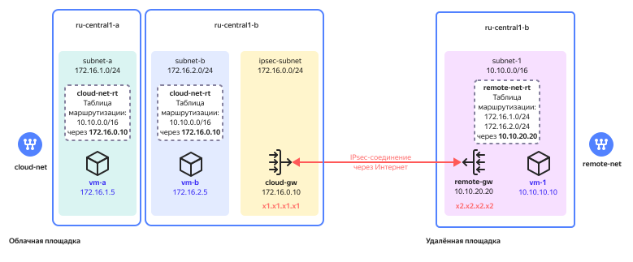

# Организация сетевой связности между облачными и удаленными ресурсами с помощью IPsec-шлюзов

Сетевое взаимодействие корпоративного ЦОД с облачными ресурсами должно быть надежно защищено. Для этой цели применяются технологии организации защищенных соединений.

Одна из таких технологий — соединение через интернет на основе IPsec-шлюзов по протоколу IPsec. Протокол [IPsec](https://www.ietf.org/rfc/rfc2401.txt) широко используется в различных сетевых устройствах, как физических, так и виртуальных.

Схема организации защищенного соединения между инфраструктурой в {{ yandex-cloud }} (облачная площадка) и условным корпоративным ЦОД (удаленная площадка) с помощью IPsec-шлюзов:

Облачная площадка:

* Сеть `cloud-net` с подсетями `subnet-a` (`172.16.1.0/24`), `subnet-b` (`172.16.2.0/24`) и `ipsec-subnet` (`172.16.0.0/24`).
* Основной IPsec-шлюз `cloud-gw` в формате ВМ на базе продукта с открытым исходным кодом [strongSwan](https://github.com/strongswan/strongswan). IPsec-шлюз подключается к подсети `ipsec-subnet`. Основная задача шлюза — организация IPsec-соединения с удаленным шлюзом и обеспечение сетевого взаимодействия между тестовыми ВМ.
* Группа безопасности `cloud-net-sg` применяется на сетевом интерфейсе ВМ основного шлюза и разрешает прохождение IPsec-трафика между шлюзами.
* Таблица маршрутизации со статическими маршрутами `cloud-net-rt` обеспечивает передачу трафика в направлении подсети `subnet-1` удаленной площадки через основной IPsec-шлюз.
* Тестовые ВМ `vm-a` и `vm-b` на базе Ubuntu Linux подключаются к подсетям `subnet-a` и `subnet-b` соответственно. С помощью этих ВМ проверяется IP-связность через IPsec-соединение.

Удаленная площадка:

* Сеть `remote-net` с подсетью `subnet-1` (`10.10.0.0/16`).
* Удаленный IPsec-шлюз `remote-gw` в формате ВМ на базе продукта с открытым исходным кодом [strongSwan](https://github.com/strongswan/strongswan). IPsec-шлюз подключается к подсети `subnet-1`. Основная задача шлюза — организация IPsec-соединения с основным шлюзом и обеспечение сетевого взаимодействия между тестовыми ВМ.
* Группа безопасности `remote-net-sg` применяется на сетевом интерфейсе ВМ удаленного шлюза и разрешает прохождение IPsec-трафика между шлюзами.
* Таблица маршрутизации со статическими маршрутами `remote-net-rt` обеспечивает передачу трафика в направлении подсетей `subnet-а` и `subnet-b` облачной площадки через удаленный IPsec-шлюз.
* Тестовая ВМ — `vm-1` на базе Ubuntu Linux подключается к подсети `subnet-1`. С помощью этой ВМ проверяется IP-связность через IPsec-соединение.

IPsec-соединение устанавливается между публичными IP-адресами основного (`x1.x1.x1.x1`) и удаленного (`x2.x2.x2.x2`) шлюзов.