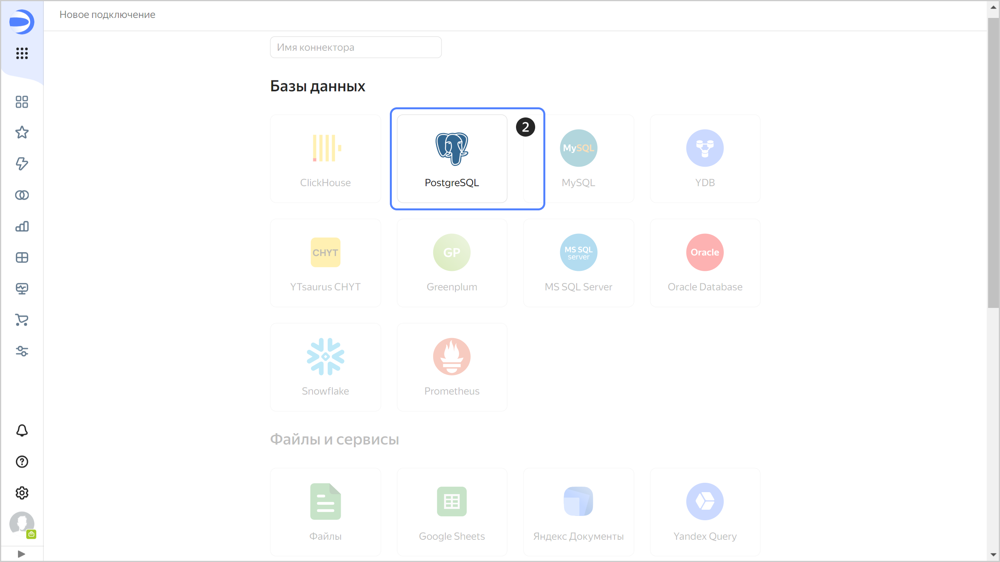
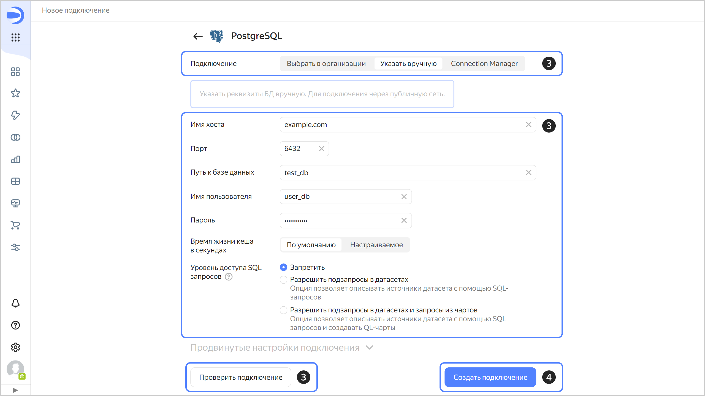
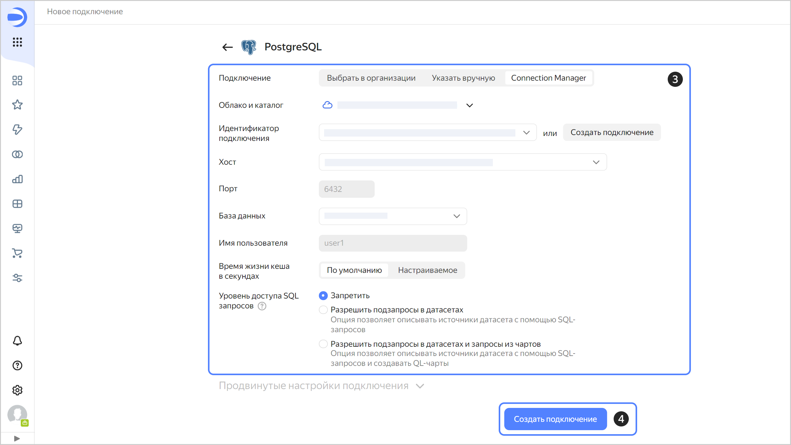
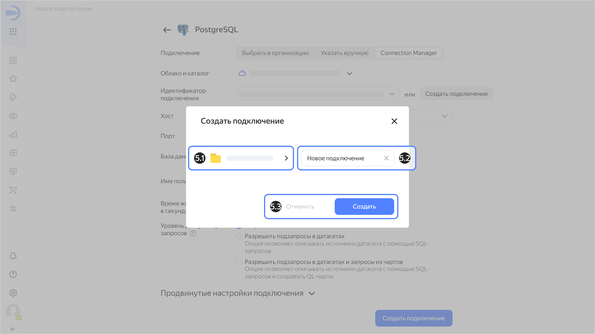
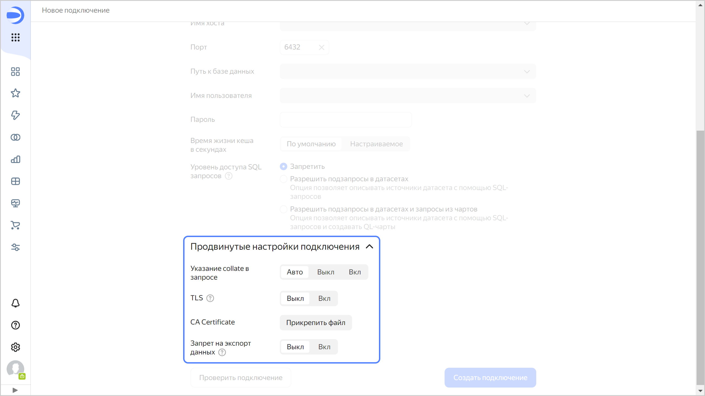

# Создание подключения к {{ PG }}



Чтобы создать подключение к {{ PG }}:

1. Перейдите на [страницу создания нового подключения]({{ link-datalens-main }}/connections/new).
1. В разделе **Базы данных** выберите подключение **{{ PG }}**.

   

1. Выберите тип подключения:

   

   - Выбрать в организации {#organization}

     

     * **Облако и каталог**. Выберите каталог, в котором находится кластер.
     * **Кластер**. Укажите кластер из списка доступных кластеров {{ PG }}. В настройках кластера должна быть активирована опция **Доступ из {{ datalens-short-name }}**. Если у вас нет доступного кластера, нажмите кнопку **Создать новый**.

       

     * **Тип хоста**. Выберите тип хоста:

       * **Обычный** (по умолчанию) — позволяет выбрать обычные хосты для подключения.
       * **Особые FQDN** — позволяет выбрать для подключения [особые FQDN](../../../managed-postgresql/operations/connect.md#special-fqdns), которые всегда указывают на текущий хост-мастер или на наименее отстающую от мастера реплику в кластере {{ PG }}.

     * **Имя хоста**. Выберите имя хоста из списка доступных в кластере {{ PG }}. Вы можете выбрать несколько хостов. Если к первому хосту подключиться не получится, {{ datalens-short-name }} выберет следующий из списка.
     * **Порт**. Укажите порт подключения к {{ PG }}. В {{ yandex-cloud }} по умолчанию используется порт 6432.
     * **Путь к базе данных**. Укажите имя подключаемой базы данных.
     * **Имя пользователя**. Укажите имя пользователя для подключения к {{ PG }}.
     * **Пароль**. Укажите пароль для пользователя.
     * **Время жизни кеша в секундах**. Укажите время жизни кеша или оставьте значение по умолчанию. Рекомендованное значение — 300 секунд (5 минут).
     * **Уровень доступа SQL запросов**. Позволяет использовать произвольный SQL-запрос для [формирования датасета](../../dataset/settings.md#sql-request-in-datatset).

       Чтобы проверить корректность введенных параметров, нажмите кнопку **Проверить подключение**.

     

   - Указать вручную {#manual}

     

     

     Чтобы проверить корректность введенных параметров, нажмите кнопку **Проверить подключение**.

     

   - {{ connection-manager-name }} {#conn-man}

     

     Выберите [подключение](../../../metadata-hub/concepts/connection-manager.md) к кластеру с управляемой БД {{ PG }}, созданное в сервисе {{ connection-manager-full-name }}:

     * **Облако и каталог**. Выберите каталог, в котором создано подключение к кластеру.
     * **Идентификатор подключения**. Выберите одно из доступных подключений в {{ connection-manager-name }} или [создайте новое](../../../metadata-hub/operations/create-connection.md).
     * **Хост**. Выберите хост из списка доступных в кластере {{ PG }}.
     * **Порт**. Заполняется автоматически в зависимости от выбранного хоста.
     * **База данных**. Выберите имя подключаемой базы данных.
     * **Имя пользователя**. Заполняется автоматически из данных выбранного подключения.
     * **Время жизни кеша в секундах**. Укажите время жизни кеша или оставьте значение по умолчанию. Рекомендованное значение — 300 секунд (5 минут).
     * **Уровень доступа SQL запросов**. Позволяет использовать произвольный SQL-запрос для [формирования датасета](../../dataset/settings.md#sql-request-in-datatset).

     

   

1. Нажмите кнопку **Создать подключение**.

1. В открывшемся окне:

   
   1. Выберите [воркбук](../../workbooks-collections/index.md), в котором сохранится подключение, или создайте новый. Если вы пользуетесь старой навигацией по папкам, выберите папку для сохранения подключения.

   1. Укажите название подключения.
   
   1. Нажмите кнопку **Создать**.

   

## Дополнительные настройки {#postgresql-additional-settings}

Вы можете указать дополнительные параметры подключения в разделе **Продвинутые настройки подключения**:

* **Указание collate в запросе** — если в запросах к БД требуется явно задать правило сортировки, выберите один из режимов:

  * **Авто** — применяется настройка по умолчанию, решение о включении локали `en_US` остается на усмотрение {{ datalens-short-name }}.
  * **Вкл** — применяется настройка {{ datalens-short-name }}, для отдельных выражений в запросе указывается локаль `en_US`. Это приводит к использованию соответствующей логики сортировки сервером, вне зависимости от настроек сервера и конкретных таблиц. Используйте настройку {{ datalens-short-name }}, если локаль в БД несовместима с работой {{ datalens-short-name }}. Подробнее о локали и `LC_COLLATE` смотрите в разделе [{#T}](../../../managed-postgresql/operations/cluster-create.md#create-cluster).
  * **Выкл** — применяется настройка по умолчанию, {{ datalens-short-name }} использует только имеющиеся параметры локали БД.

* **TLS** — опция определяет необходимость использования протокола TLS. Когда опция включена, параметр `sslmode` принимает значение `required`, когда выключена — `prefer`.
* **CA Certificate** — чтобы загрузить сертификат, нажмите кнопку **Прикрепить файл** и укажите файл сертификата. Когда сертификат загружен, поле отображает название файла.
* 

