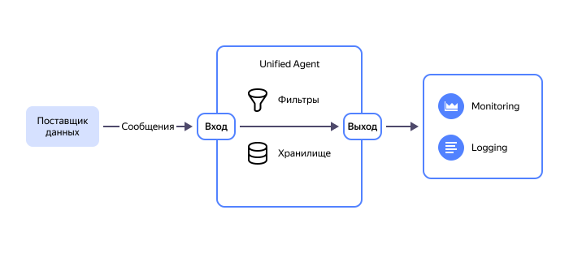
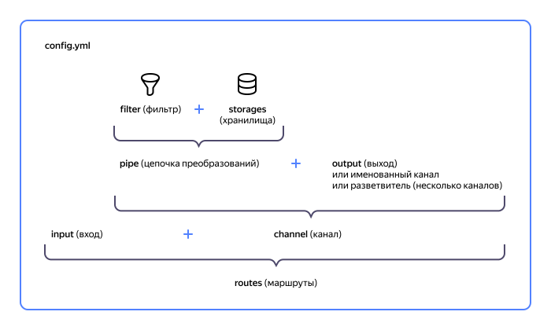

# Агент для поставки метрик



- VK

  <iframe src="https://vk.com/video_ext.php?oid=-200452713&id=456239453&hash=1cd0d8eb71fb0296" width="640" height="360" frameborder="0" allowfullscreen="1" allow="autoplay; encrypted-media; fullscreen; picture-in-picture"></iframe>

- YouTube

  [Смотреть видеоинструкцию о сборе метрик через {{ unified-agent-short-name }} на YouTube](https://www.youtube.com/watch?v=EY6c_6YYF10).



{{ unified-agent-full-name }} — агент для поставки дополнительных метрик виртуальных машин и пользовательских приложений в сервис {{ monitoring-full-name }}.

Агент поддерживает:

- [сбор системных метрик Linux](../../../operations/unified-agent/linux_metrics.md) (процессор, память, диск);
- сбор метрик в формате [Prometheus](https://prometheus.io);
- поставку метрик в {{ monitoring-full-name }};
- файловое хранилище для надежной доставки данных.

Примеры использования агента приведены в разделе [{#T}](../../../operations/index.md#working-with-metrics). Подробнее про способы установки {{ unified-agent-short-name }} читайте в разделе [{#T}](./installation.md). Синтаксис файла конфигурации агента описан в разделе [{#T}](./configuration.md).

## Основные понятия {#basics}

{{ unified-agent-full-name }} предназначен для передачи потоковых данных, представленных в виде сообщений, например, метрик или логов. Поток данных в {{ unified-agent-short-name }} называется сессией. Одновременно может быть установлено множество сессий.

Агент получает сообщения через вход и отправляет их в один или несколько выходов. Для промежуточной обработки сообщений существуют фильтры, а для сохранения на диск — хранилища. Входы, выходы, фильтры и хранилища реализуются при помощи плагинов.

Для маршрутизации сообщений существуют маршруты доставки, состоящие из входа и канала. Канал состоит из цепочки преобразований и узла одного из типов: выход, канал или разветвитель. Цепочка преобразований может содержать фильтры и ссылки на хранилища. Цепочка преобразований может отсутствовать.

Вы можете создавать именованные каналы и цепочки обработки. Это позволит избежать дублирования конфигурации и направить сообщения из многих входов в один выход.

## Схема работы {{ unified-agent-short-name }} {#scheme}

## Сообщения {#messages}

Сообщение — это минимальная неделимая единица пользовательской информации, которая передается от системы или приложения в {{ unified-agent-short-name }}.

Сообщение состоит из тела, временной метки, пользовательских метаданных в формате `ключ:значение` и порядкового номера.



Для правильной агрегации данных в мониторинге [целочисленные метрики](../../../concepts/data-model.md#metric-types) `COUNTER` при загрузке в {{ monitoring-name }} переводятся в `DGAUGE`.



## Сессии {#sessions}

Сессия — это упорядоченный поток сообщений. Сессия имеет идентификатор, который должен быть уникальным среди всех установленных сессий, и пользовательские метаданные в формате `ключ:значение`.

Все сообщения, переданные в рамках сессии, содержат как метаданные сообщения, так и метаданные сессии.

Виды собираемой информации (входы), преобразование (фильтры), место для промежуточного хранения (хранилище) и выходы задаются в файле конфигурации {{ unified-agent-short-name }}. 

## Входы {#inputs}
Вход предназначен для получения агентом сообщений, которые передаются в рамках сессий. Вход может содержать настройки инфраструктуры работы с сессиями для конфигурирования различных ограничений.

См. также [список реализованных входов](inputs.md).

## Выходы {#outputs}

Выход предназначен для отправки агентом сообщений в сторонние системы. В настоящий момент поддерживается выход `yc_metrics` для записи метрики в {{ monitoring-full-name }} API, а также несколько отладочных выходов.

См. также [список реализованных выходов](outputs.md).

## Фильтры {#filters}

Фильтр предназначен для отбрасывания, преобразования и агрегации сообщений.

Типы фильтров:

- обычные — работают с каждым сообщением в отдельности;
- накопительные — преобразуют набор входных сообщений в одно выходное.

См. также [список реализованных фильтров](filters.md).

## Хранилища {#storages}
Хранилища предназначены для промежуточного хранения сообщений от поступления на вход и до передачи на выход.
Используя хранилище, вы не потеряете данные, если агенту не удалось записать их в указанный выход. Например, из-за сетевых проблем или недоступности API, куда отправляются сообщения.

См. также [конфигурирование хранилищ](storage.md).

## Маршрутизация {#routing}

### Цепочки преобразований {#pipes}
Цепочки преобразований содержат:
* набор фильтров, через которые последовательно проходят сообщения;
* ссылку на хранилище, где будут храниться сообщения до передачи на выход.

Цепочки преобразований можно делать именованными.

См. также [конфигурирование цепочек преобразований](routing.md#pipes).

### Каналы {#channels}

Каналы группируют цепочку преобразований и один из узлов: выход, именованный канал или разветвитель.

Разветвитель позволяет указать набор каналов и копирует поступающее в него сообщение в каждый из своих каналов. При помощи разветвителя можно продублировать потоки в разные выходы, а комбинируя разветвители и фильтры, можно направлять разные сообщения в разные каналы по некоторым признакам, например, по метаданным.

Каналы можно делать именованными.

См. также [конфигурирование именованных каналов](routing.md#channels).

### Маршруты доставки {#routes}

Маршрут доставки объединяет вход и канал.

Маршруты доставки, каналы и цепочки обработки позволяют сконфигурировать произвольное дерево обработки сообщений.

Взаимосвязь элементов дерева обработки сообщений представлена на схеме.

