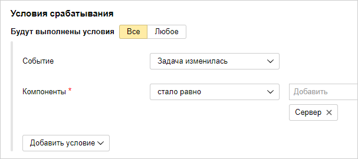
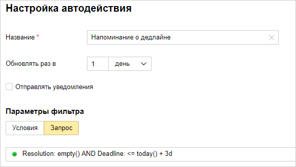

# Автоматизировать рутинные действия

Типовые действия с задачами в {{ tracker-name }} можно автоматизировать с помощью [триггеров, автодействий и макросов](automation.md). Вы можете изменять параметры задачи при наступлении определенных событий, периодически или по команде, а также создавать новые задачи по расписанию.

Рассмотрим несколько примеров автоматизации в {{ tracker-name }}:

### Автоматически назначать исполнителя задачи {#auto-assign-executor}

Если задача относится к области ответственности определенного сотрудника, можно автоматически назначить его исполнителем задачи с помощью [триггера](user/trigger.md). Триггер срабатывает при заданных условиях и автоматически меняет параметры задачи.

Например, тестировщик должен приступать к тестированию новой функции продукта, когда разработчик перевел задачу в статус «{{ ui-key.startrek-backend.presets.advancedDevelopment.board.column.ready.for.test }}». Чтобы автоматически назначать тестировщика исполнителем задачи, настройте триггер следующим образом:

- Условия срабатывания: задача изменилась и перешла в статус «{{ ui-key.startrek-backend.presets.advancedDevelopment.board.column.ready.for.test }}».

- Действие триггера: в поле «Исполнитель» указать тестировщика.


Рассмотрим другой пример, когда серверной частью продукта занимается один разработчик, а клиентской частью — другой. При создании новых ошибок, относящихся к серверной или клиентской части, можно автоматически назначать исполнителем ответственного разработчика при помощи компонентов и триггеров:

1. В вашей очереди [настройте компоненты](manager/components.md), которые соответствуют частям продукта: «Сервер» и «Клиент». При создании новой ошибки добавляйте в нее нужный компонент.

1. Настройте триггер для ошибок в серверной части:

    - Условия срабатывания: задача изменилась и поле «Компоненты» стало равно «Сервер».

    - Действие триггера: в поле «Исполнитель» указать разработчика серверной части.

    

1. Настройте аналогичный триггер для ошибок в клиентской части:

    - Условия срабатывания: задача изменилась и поле «Компоненты» стало равно «Клиент».

    - Действие триггера: в поле «Исполнитель» указать разработчика клиентской части.

Подробно пример настройки триггера описан в разделе [{#T}](manager/trigger-examples.md#assign_ticket).

### Напоминать исполнителю задачи о дедлайне {#auto-remind-deadline}

Чтобы исполнители не забывали выполнять задачи вовремя, можно отправлять им напоминания с помощью автодействия. Автодействие срабатывает периодически и обновляет параметры задач, которые соответствуют заданным условиям.

Например, нужно раз в день проверять все задачи в вашей очереди. Если задача не решена и срок, указанный в поле «Дедлайн», наступит менее чем через 3 дня, нужно добавлять к задаче комментарий и призывать исполнителя задачи. Для этого настройте автодействие следующим образом:

- Тип автодействия: **Обновление задач**.

- Периодичность: 1 раз в день.

- Параметры фильтра: запрос, написанный с помощью [языка запросов](user/query-filter.md): 

    ```
    Resolution: empty() AND Deadline: <= today() + 3d
    ```

    

- Действие над задачей: отправить комментарий и призвать пользователя из поля «Исполнитель». 

Подробно пример настройки автодействия описан в разделе [{#T}](user/create-autoaction.md#autoaction_example).

### Создавать повторяющиеся задачи {#auto-create-task}

Если требуется периодически создавать задачи по определенному шаблону, это можно сделать с помощью автодействий. Например, каждую неделю создавать задачу на резервное копирование данных.

Для этого настройте автодействие следующим образом:

- Тип автодействия: **Создание задач**.

- Периодичность действия: 1 раз в неделю по пятницам.

    Вы можете задать начало и конец интервала, в течение которого будет действовать автоматическое создание задач. Если интервал не указан, создание задач будет действовать постоянно.

    

- Действие в очереди: создать задачу. Заполните поля шаблона для автоматического создания задач.

Подробно пример настройки автодействия описан в разделе [{#T}](user/create-autoaction.md#autoaction_example).